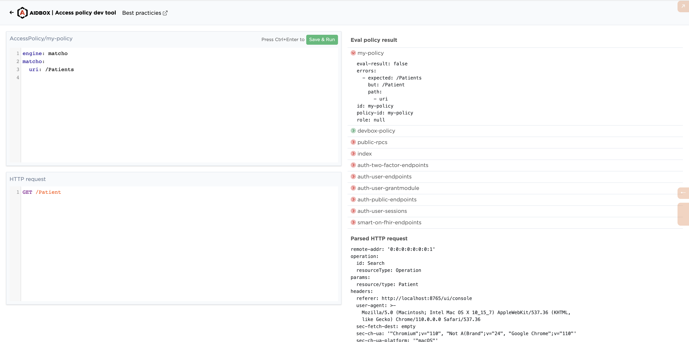
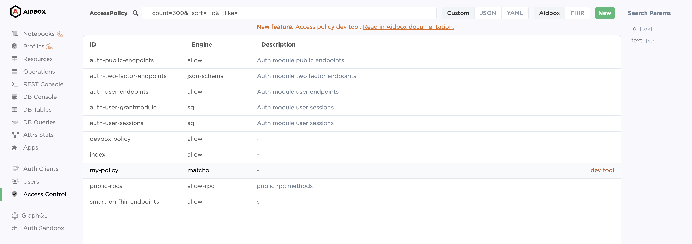
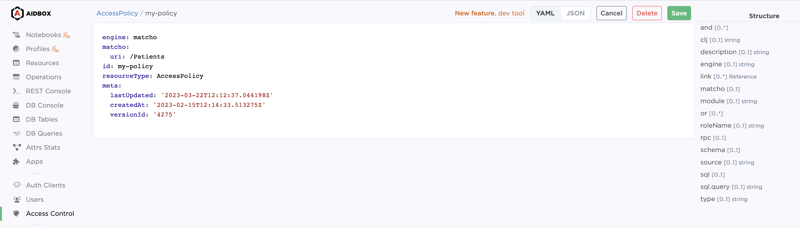

# Deprecated Access Policy Dev Tool

Access policy dev tool simplifies development & debugging AccessPolicy resources. It was introduced in March v2303 release of Aidbox.


If you have any questions or ideas, how to make the dev tool better, feel free to communicate with us in [Aidbox community chat](https://t.me/aidbox).


## Overview

The dev tool is a part of Aidbox UI Console, which aims

* to edit AccessPolicy resource, and
* to give a nice view for AccessPolicy debug output for specific request in the same place.

<figure><figcaption><p>Access policy dev tool</p></figcaption></figure>

The dev tool is split on two sides, editor side and result side. On the left side you define

* [AccessPolicy resource](../../access-control/authorization/access-policies.md) and
* HTTP request you are going to debug.

When you press the Save\&Run button, the dev tool saves AccessPolicy and performs policy debug operation for the specified request, and displays the result on the right side. You can see there

* _Eval policy result._ List of all access policies and the result of evaluation.
* _Parsed HTTP request._ It's an internal representation of the request, which Aidbox passes to the eval-policy function.

## How to get to the dev tool

To get to the dev tool from AccessPolicy list page, click the _dev tool_ link on a AccessPolicy you want to debug.

<figure><figcaption><p>AccessPolicy list with the link to dev tool</p></figcaption></figure>

To get to the dev tool from AccessPolicy view page, click the link on the top right corner.

<figure><figcaption><p>AccessPolicy view page with the link to dev tool</p></figcaption></figure>

## Tips

### Make sure you've enabled Aidbox developer mode

```
BOX_SECURITY_DEV_MODE=true
```

### How to send request on behalf of user or client?

By default Aidbox sends requests with your current session (your identity and permissions). To authenticate with another session, add Authorization header to the request.

Example of the request with the provided Authorization header.

```yaml
GET /Patient
Authorization: Bearer eyJ...w5c
```

### Debug token

Access policy dev tool expects you to have permission to run aidbox.auth/get-eval-policy-debug-token RPC method. Dev tool automatically renews the token.

To check you have access to to the RPC method, send the following in Aidbox REST Console.

```yaml
POST /rpc
accept: text/yaml

method: aidbox.auth/get-eval-policy-debug-token

# Response: 200 OK
# Body:
# result:
#  token: <temp-debug-token>
```

## That's it

Access policy dev tool makes it easier to develop access policy. If you have any questions or ideas, how to make the dev tool better, feel free to communicate with us in [Aidbox community chat](https://t.me/aidbox).

### What's next

If you are looking for recommendations, how to develop access policies, check out our [AccessPolicy best practices article](accesspolicy-best-practices.md).

## Talk to a Health Samurai Engineer

If you'd like to learn more about using Aidbox or have any questions about this guide, [connect with us on Telegram](https://t.me/aidbox). We're happy to help.
