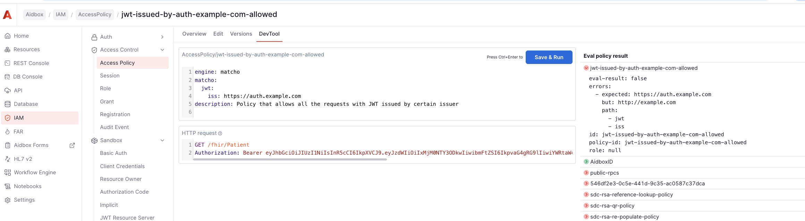

# Access policies examples

This guide provides examples of access policies for different use cases.
Each example includes:
*	A description of the use case
*	The policy itself
*	A sample request for testing in Dev Tool

<figure><figcaption></figcaption></figure>


See also:
* [Access Policies](../../access-control/authorization/access-policies.md)
* [Access Policy Dev Tool](access-policy-dev-tool.md)
* [Access Policies Best Practices](accesspolicy-best-practices.md)
* [Matcho DSL Reference](../../reference/matcho-dsl-reference.md)


## 1. Policy that allows a system to update their patients

**Description:**
We have a couple of systems. Each system maintain ther own patients with identifiers. We want to allow these systems to update their patients - patients that have identifiers from their own system.
There's a Client resource in Aidbox created for each system.

**Policy:**
```yaml
id: as-system1-app-update-patients
resourceType: AccessPolicy
engine: matcho
link:
  - reference: Operation/FhirConditionalUpdate
  - reference: Client/system1-client
description: Policy that allows a system1 to update their patients
matcho:
  params:
    resource/type: Patient
    identifier: "#http://system1"
  resource:
    identifier:
      $contains:
        system: http://system1

```

**Request to test the policy:**

```http
PUT /fhir/Patient/123
Authorization: Basic <base64(system1-client:client-secret)> # Base64 encoded client-id and client-secret
content-type: application/json
accept: application/json

{
  "resourceType": "Patient",
  "id": "123",
  "identifier": [
    {
      "system": "http://system1",
      "value": "12345"
    }
  ],
  "name": [
    {
      "use": "official",
      "family": "Doe",
      "given": ["John"]
    }
  ],
  "gender": "male",
  "birthDate": "1980-01-01"
}
```

## 2. Policy that allows a system to search for their patients

**Description:**
We have a couple of systems. Each system maintain ther own patients with identifiers. We want to allow these systems to get their patients - patients that have identifiers from their own system.

**Policy:**
```yaml
id: as-system1-app-read-patients
resourceType: AccessPolicy
engine: matcho
link:
  - reference: Operation/FhirSearch
  - reference: Client/system1-client
description: Policy that allows a system1 to search for their patients
matcho:
  params:
    resource/type: Patient
    identifier: "#http://system1"
```

**Request to test the policy:**

```http
GET /fhir/Patient?id=123&identifier=http://system1|123
Authorization: Basic <base64(system1-client:client-secret)> # Base64 encoded client-id and client-secret
```

## 3. Policy that allows an application to do CRUD on Patient and Practitioner resources.

**Description:**
We have an application that is registered as a Client resource with id `client-id` in Aidbox. We want to allow this application to do CRUD on Patient and Practitioner resources.

**Policy:**
```yaml
id: as-client-id-crud-patients-and-practitioners
resourceType: AccessPolicy
engine: matcho
link:
  - reference: Client/client-id
description: Policy that allows an client-id to do CRUD on Patient and Practitioner resources
matcho:
  params:
    resource/type:
      $enum:
        - Patient
        - Practitioner
  request-method:
    $enum:
      - get
      - post
      - patch
      - put
```

**Request to test the policy:**

```http
GET /fhir/Patient
Authorization: Basic <base64(client-id:client-secret)> # Base64 encoded client-id and client-secret
```

## 4. Policy that allows an admin access to Aidbox UI to the admin users

**Description:**
We have integration with external identity provider configured in Aidbox. We want to users with the role `Aidbox-Admins` to access Aidbox UI.

**Policy:**
```yaml
id: as-admin-allowed-access-to-aidbox-ui
resourceType: AccessPolicy
engine: matcho
description: Policy that allows admin access to Aidbox UI for admin users
matcho:
  user:
    data:
      groups:
        $contains: Aidbox-Admins
  request-method:
    $enum:
      - get
      - post
      - put
      - delete
```
**See also:**
* [Managing Admin Access to the Aidbox UI Using Okta Groups](../../tutorials/security-access-control-tutorials/managing-admin-access-to-the-aidbox-ui-using-okta-groups.md)

## 5. Policy that allows access to Workflow Engine screen only for a specific engineer

**Description:**
We want to grant a specific engineer (identified by email) access to only the Workflow Engine screen in Aidbox UI. This policy restricts access to the `/rpc` endpoint with specific limitations on the `_m` parameter values, allowing only workflow-related operations. 

**Policy:**
```yaml
id: as-engineer-allowed-to-access-workflow-engine
resourceType: AccessPolicy
engine: matcho
link:
  - reference: Operation/rpc
description: Policy that allows access to Workflow Engine screen only for a John Doe engineer
matcho:
  user:
    data:
      email: john.doe@example.com
  params:
    _m:
      $enum:
        - awf.workflow/list
        - awf.task/list
        - awf.task/status
        - awf.workflow/status
```


## 6. Policy that allows graphql search requests to the Patient resource

**Description:**
We want to allow a an application, registered as a Client resource in Aidbox, to search the Patient resource using GraphQL.
[GraphQL Access Control mode](../../reference/settings/modules.md#module.graphql.access-control) is set to `rest-search`.
```yaml
BOX_FEATURES_GRAPHQL_ACCESS__CONTROL=rest-search
```

**Policy:**
```yaml
id: as-client-allowed-graphql-search-patients
resourceType: AccessPolicy
engine: matcho
link:
  - reference: Client/my-client
description: Policy that allows graphql search requests to the Patient resource for my-client client
matcho:
  request-method: get
  uri: /Patient
```

**Request to test the policy:**

```graphql
query { PatientList(_count: 1) { id } }
```

## 7. Organization-based hierarchical access control policy for a end-user

**Description:**
This example allows an org-based user (created by `PUT /Organization/<org-id>/fhir/User`) to see patients that are also created in the same organization.

**Policy:**
```yaml
id: as-user-allowed-to-see-patients-in-organization
resourceType: AccessPolicy
engine: matcho
link:
  - reference: Operation/FhirSearch
description: A user should be able to get every patient in their organization.
matcho:
  params:
    resource/type: Patient
  request-method: get
  user:
    meta:
      extension:
        $contains:
          url: https://aidbox.app/tenant-organization-id
          value:
            Reference:
              id: .params.organization/id
```

**Request to test the policy:**

```http
GET /Organization/org-a/fhir/Patient/pt-1
```

**See also:**
* [Organization-based hierarchical access control](../../access-control/authorization/scoped-api/organization-based-hierarchical-access-control.md)

## 8. Policy that allows all the requests with JWT issued by certain issuer

**Description:**
[Token introspector](../../tutorials/security-access-control-tutorials/set-up-token-introspection.md) is configured in Aidbox to trust JWT issued by certain issuer - `https://auth.example.com`. We want to allow all the requests with JWT issued by this issuer.

**Policy:**
```yaml
id: jwt-issued-by-auth-example-com-allowed
resourceType: AccessPolicy
engine: matcho
description: Policy that allows all the requests with JWT issued by certain issuer
matcho:
  jwt:
   iss: https://auth.example.com
```

**Request to test the policy:**

```http
GET /fhir/Patient
Authorization: Bearer <your-jwt>
```
## 9. Policy that allows the practitioner to read their patients

**Description:**
Practitioner is registered in Aidbox as a `User` resource with practitioner id stored in `User.data.practitioner_id` element. We want to allow the practitioner to read their patients.

**Policy:**
```yaml
id: as-practitioner-allowed-to-see-his-patients
resourceType: AccessPolicy
engine: matcho
link:
- reference: Operation/FhirSearch
description: Policy that allows the practitioner to read their patients
matcho:
  params:
    # Only for Patient resources
    resource/type: Patient
    # query parameter general-practitioner should be equal to user.data.practitioner_id
    general-practitioner: .user.data.practitioner_id
  user: 
    # user.data.practitioner_id should be present
    data: 
      practitioner_id: present?

```

**Request to test the policy:**

```http
GET /fhir/Patient?general-practitioner=pr-1
```

## 10. Policy that allows the practitioner to read patients bases on given consent.

**Description:**
Consent is stored in Aidbox as a `Consent` resource, with practitioner id stored in `Consent.actor` element. Practitioner is registered in Aidbox as a `User` resource with practitioner id stored in `User.data.practitioner_id` element. We want to allow the practitioner to read patients based on given consent.

**Policy:**
```yaml
id: as-practitioner-allowed-to-read-patients-with-consent
resourceType: AccessPolicy
engine: matcho
link:
  - reference: Operation/FhirSearch
description: Policy that allows the practitioner to read patients based on given consent
matcho:
  user: present?
  params:
    _has:Consent:patient:actor: .user.fhirUser.id
    _has:Consent:patient:scope: Encounter
    _revinclude: Encounter:subject
  request-method: get

```

**Request to test the policy:**

```http
GET /fhir/Patient?_has:Consent:patient:actor=<practitioner-id>
```

## 11. Policy that allows the practitioner to create Observations for their patients

**Description:**
Practitioner is registered in Aidbox as a `User` resource with practitioner id stored in `User.data.practitioner_id` element. We want to allow the practitioner to create observations for their patients. The relation between the practitioner and the patient is stored in `Patient.generalPractitioner` element.

**Policy:**
```yaml
id: as-practitioner-allowed-to-create-observations-for-their-patients
resourceType: AccessPolicy
engine: sql
link:
  - reference: Operation/FhirCreate
description: Allow practitioner to create observations for their patients    
sql:
  query: |-
    SELECT
      {{user}} IS NOT NULL
      AND {{user.data.practitioner_id}}::text IS NOT NULL
      AND {{params.resource/type}} = 'Observation'
      AND {{request-method}} = 'post'
      AND EXISTS (
        SELECT 1 FROM patient p
        WHERE p.id = split_part(({{resource.subject.reference}})::text, '/',2)
        AND p.resource->'generalPractitioner' @>
          jsonb_build_array(
            jsonb_build_object(
              'resourceType', 'Practitioner',
              'id', {{user.data.practitioner_id}}::text
            )
          )
      );
```

**Request to test the policy:**

```http
POST /fhir/Observation
Content-Type: application/json
Accept: application/json

{
  "resourceType": "Observation",
  "status": "final",
  "code": {
    "coding": [
      {
        "system": "http://loinc.org",
        "code": "29463-7",
        "display": "Body Weight"
      }
    ]
  },
  "subject": {
    "reference": "Patient/pt-2"
  },
  "effectiveDateTime": "2025-09-08T10:00:00Z",
  "valueQuantity": {
    "value": 72,
    "unit": "kg",
    "system": "http://unitsofmeasure.org",
    "code": "kg"
  }
}
```
