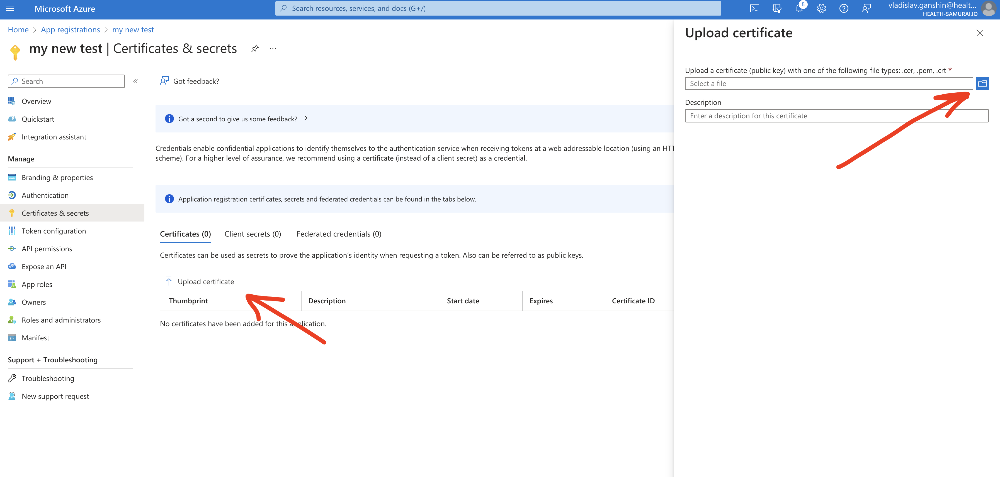

# How to configure Azure AD SSO with certificate authentication for access to the Aidbox UI


This guide explains how to set-up Azure AD identity provider in Aidbox with an asymmetric authentication mechanism. If you are looking for symmetric (secret-based one), please, follow [Azure AD guide](azure-ad.md).


## Register an application in Azure

* Find **App Registration** in search bar


* Click **New Registration**

<figure><figcaption></figcaption></figure>

* Fill form. For Redirect URI choose `web` as a platform and input `https://<box-url>/auth/callback/azure`


## Create IdentityProvider in Aidbox

Open REST console in Aidbox UI and create `IdentityProvider`

```yaml
POST /IdentityProvider
content-type: text/yaml
accept: text/yaml

id: azure
title: Azure AD
active: true
scopes:
  - profile
  - openid
system: azure
userinfo-source: id-token
authorize_endpoint: <your authorization endpoint>
token_endpoint: <your token endpoint>
client:
  id: <your application (client) id>
```

You can find application (client) id on **App Overview** page

<figure><figcaption></figcaption></figure>

and your endpoints by clicking on **Endpoints** and visiting `OpenID Connect metadata document`

<figure><figcaption></figcaption></figure>

## Issue certificate

Once IdentityProvider resource is created in Aidbox, you can generate private key & certificate:

```yaml
POST /IdentityProvider/azure/$rotate-credentials
content-type: text/yaml
accept: text/yaml

auth-method: asymmetric
confirm: true

# response 200 OK
# Private key & certificate are generated and saved in the IdentityProvider
```


Aidbox generates certificate for 365 days.


Than you may download the certificate in order to upload it to Azure AD by following the link

```
<AIDBOX_BASE_URL>/IdentityProvider/azure/$download-certificate
```

Upload the certificate into Azure AD

<figure><figcaption></figcaption></figure>

It may take few minutes when Azure starts processing the uploaded certificate.

## Log in to Aidbox

Go to your Aidbox base URL. You will be redirected to the log in page where you should now see `Sign in with Azure AD` button. Press this button and log in with Azure AD user. This user will be logged in to Aidbox Console but he won’t have any permissions. Read more in [Access Control Section](../../modules/security-and-access-control/security/) about permissions.
