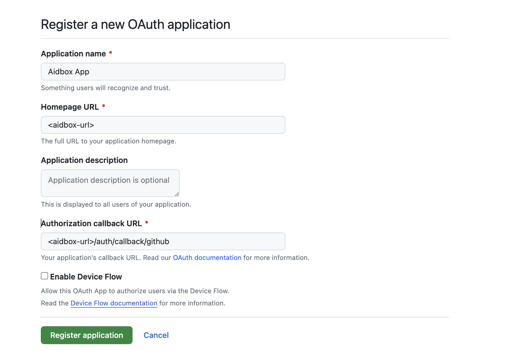
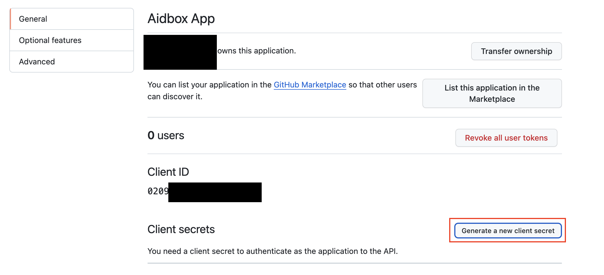
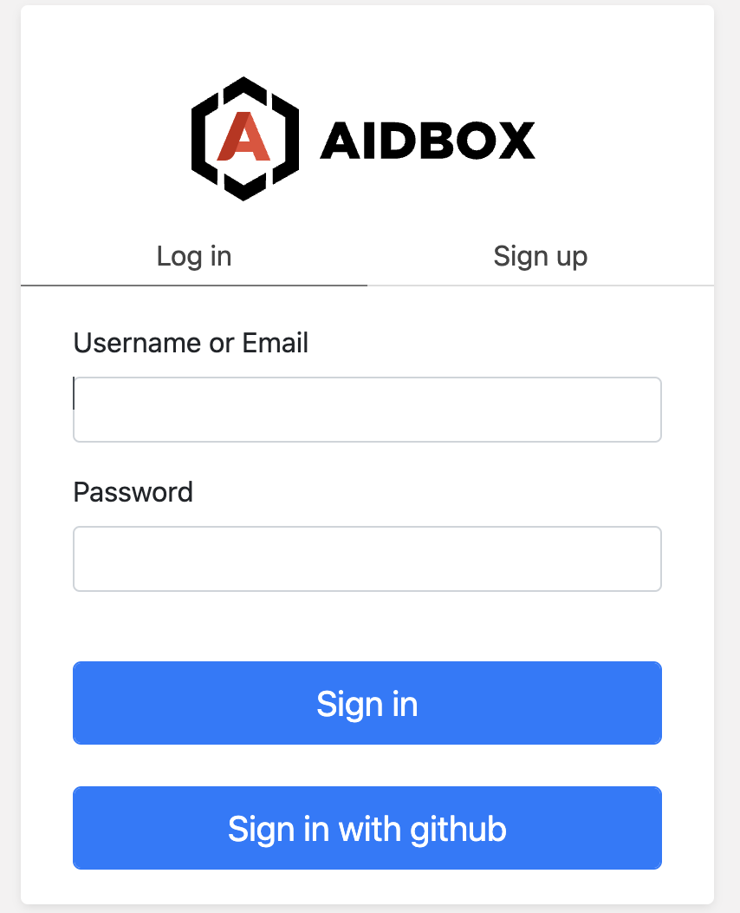

# How to configure GitHub SSO for access to Aidbox UI

## Register an OAuth application on GitHub

Open your organization's page on GitHub then **Settings > Developer Settings > OAuth Apps > New Org OAuth App.**

<figure><figcaption><p>GitHub registration OAuth app form</p></figcaption></figure>

## Generate a new secret

<figure><figcaption><p>OAuth application settings</p></figcaption></figure>

## Create an IdentityProvider in Aidbox

Using REST Console create an IdentityProvider config.

```yaml
PUT /IdentityProvider/github?_format=yaml&_pretty=true
content-type: text/yaml

type: github
active: true
system: https://github.com
scopes:
  - profile
  - openid
  - read:org
  - user
organizations:
  - <your-github-organization-name>
client:
  id: <client-id>
  secret: <client-secret>
```

## Login into Aidbox with GitHub

Go to your Aidbox base URL, you will be redirected to the login page - you should see **"Sign in with \<provider.title or .type>"** button. Press this button and log in with GitHub user into aidbox.

<figure><figcaption><p>Aidbox login page</p></figcaption></figure>

This user will be logged into Aidbox Console, but without any permissions. Read more in [Access Control Section](../../modules/security-and-access-control/security/) about permissions.
