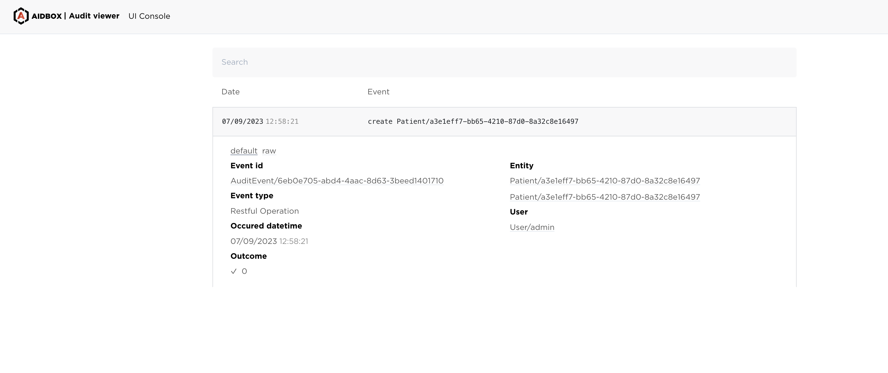

# How to Configure FHIR Audit Log

Objectives

* Enable audit logging in Aidbox.
* Receive audit logs from the FHIR API.
* View audit log event in the Audit log viewer UI application.
* Send Audit Events to an external Audit record repository.
* Create Audit Event using FHIR API.

Limitation: currently works with only FHIR R4 version. If you need to support R5 or DSTU2, please contact us.

## Configure FHIR Audit Log

### Enable FHIR Audit Log

To enable audit logging in Aidbox, use the following setting: [security.audit-log.enabled](../../reference/settings/security-and-access-control.md#security.audit-log.enabled). When enabled, Aidbox will generate structured audit logs in FHIR R4 AuditEvent format.

### Install the BALP Package

The Basic Audit Log Patterns (BALP) Implementation Guide is a Content Profile that defines some basic and reusable AuditEvent patterns. This includes basic audit log profiles for FHIR RESTful operations to be used when no more specific audit event is determined.\


1. Navigate to the **FAR** in Aidbox UI.
2. Click the **Import FHIR Package** button.
3. Find the **BALP package** and click the **Import** button.

After successful import, verify the package is installed by checking the Packages list for "Basic Audit Log Patterns".

### Make several calls

To force Aidbox to produce audit events, run any FHIR CRUD operation, e.g. run the following request in Aidbox REST Console:

```yaml
POST /fhir/Patient
content-type: text/yaml
accept: text/yaml

name:
- given: [John]
  family: Smith

# 201 Created
```

## Discover Audit Logs using FHIR API

To see audit logs with the FHIR API, run `GET /fhir/AuditEvent?_sort=-createdAt`

## Find Audit Logs with the Audit Log Viewer Application

To see audit logs with the Audit event viewer app, navigate to the **IAM -> Audit Log** tab in Aidbox Console UI.

And find the audit event, produced by the patient create operation.

<figure><figcaption></figcaption></figure>

## External Audit Repository Configuration


This functionality is available starting from version 2506.


Aidbox supports forwarding audit logs produced by Aidbox to an external repository. It batches individual **AuditEvent** resources into a FHIR `Bundle` of type `collection` and send the bundle to the configured repository endpoint with an HTTP `POST` request.

To configure an external Audit log repository, use the following settings:

* URL of the external destination where Aidbox streams all audit events
* [security.audit-log.flush-interval](../../reference/settings/security-and-access-control.md#security.audit-log.flush-interval) - Interval time in ms to flush audit events to Audit Log Repository
* [security.audit-log.max-flush-interval](../../reference/settings/security-and-access-control.md#security.audit-log.max-flush-interval) - Maximum interval for retries if sending audit events fails
* [security.audit-log.batch-count](../../reference/settings/security-and-access-control.md#security.audit-log.batch-count) - Maximum count of Audit Events in a batch
* [security.audit-log.request-headers](../../reference/settings/security-and-access-control.md#security.audit-log.request-headers) - Custom headers to add to repository requests

## Reliability of Audit Event Storing

Aidbox prioritizes the reliability of audit event storage, even when dealing with validation errors or system inconsistencies. When an incorrect AuditEvent is generated (e.g., BALP package is not installed):

* The system will still write it to the Aidbox database with a warning in the log
* The AuditEvent will be forwarded to the external repository (if configured)

For external repositories, there is a possibility of receiving errors (such as HTTP 500) when sending malformed AuditEvents. In this case:

* Aidbox will retry sending according to the configured flush intervals
* Repository systems should implement appropriate error handling for invalid payloads to prevent infinite retry loops

If an exception occurs during the AuditEvent preparation or saving process, Aidbox will fail the user request rather than creating an incomplete audit trail. This approach ensures the integrity of audit logging even at the cost of operation availability.
