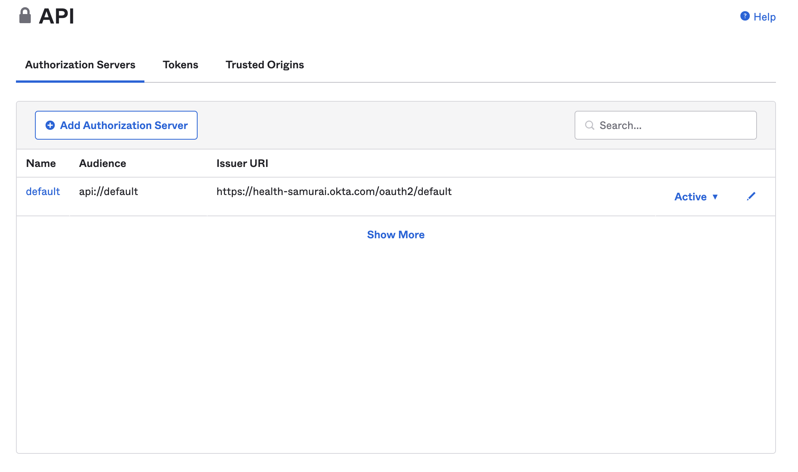
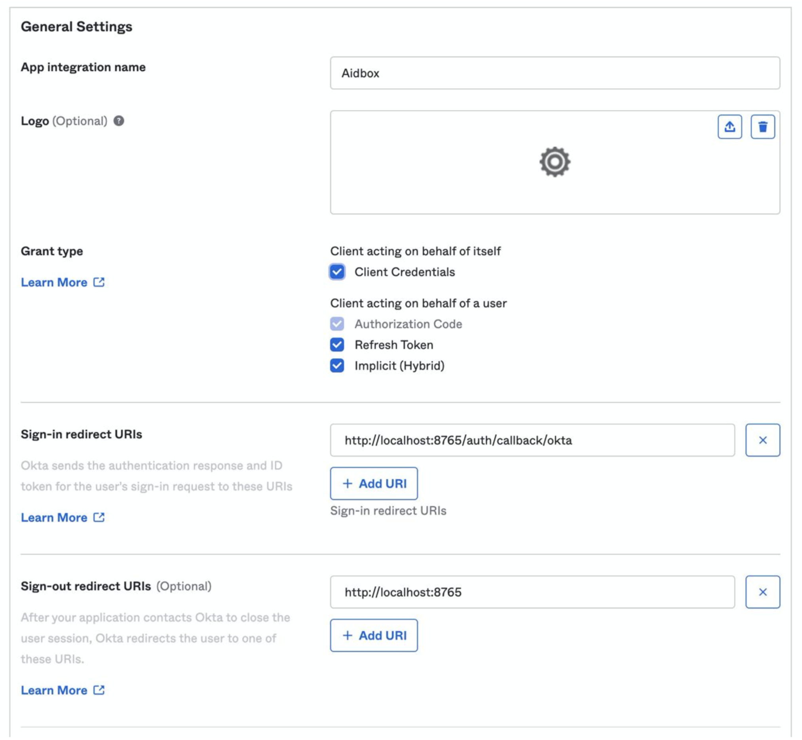
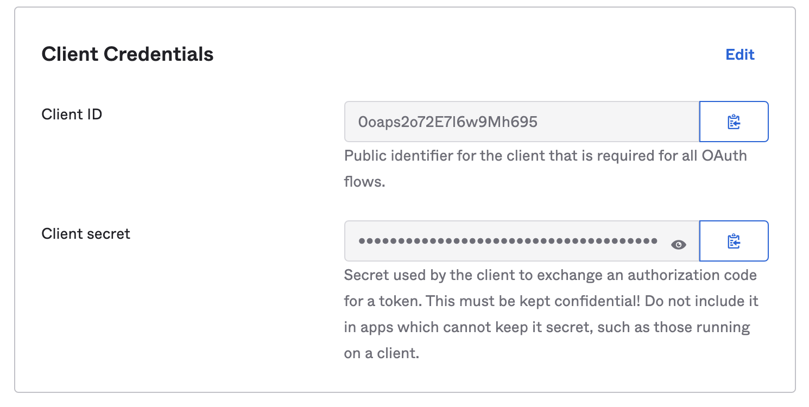
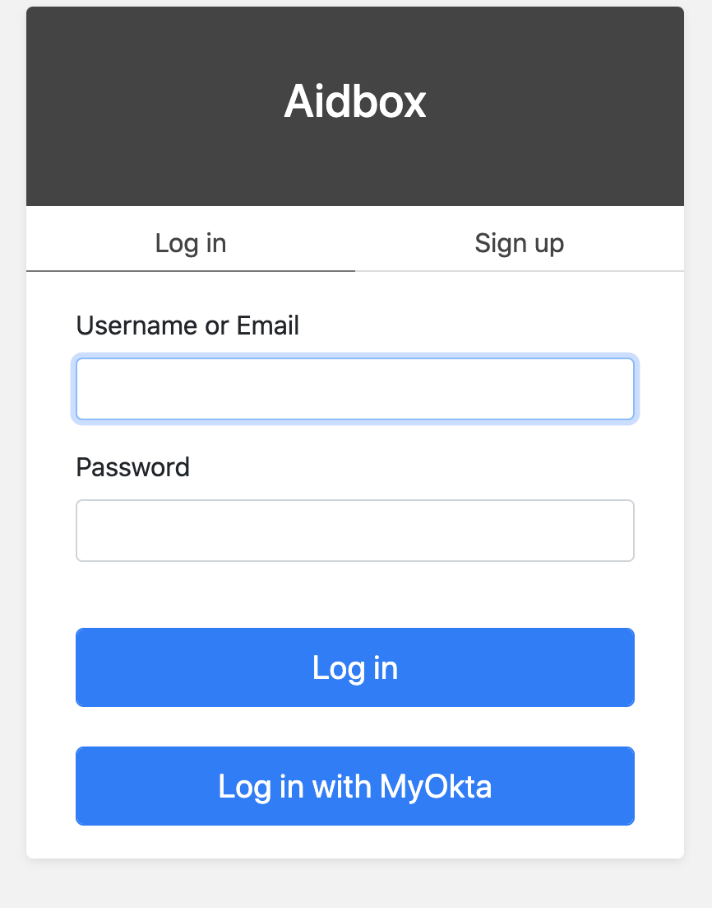

# How to Configure SSO with Okta to Access Aidbox UI



Please make sure you use Aidbox v:2107 or later Aidbox version


## Create an Account in Okta

If you do not have an Okta account, create it to get your authorization server ([Okta developer portal](https://developer.okta.com)).

Find your **okta domain**. You can do it in **Security -> API**



## Create a Client (Application) in Okta

Go to **Application -> Application** in Okta and create a new one.

* Check **Authorization Code** Grant Type
* Set Sign-in url to _**\<box-url>**/auth/callback/**\<identity-provider-id>**_



Checkout **Client ID** and **Client secret**



## Create an IdentityProvider in Aidbox

Using REST Console create an IdentityProvider config. Replace **\<okta-domain>** with your okta domain.

* `client.redirect_uri` should be _**\<box-url>**/auth/callback/**\<identity-provider-fdid>**_
* set `client.client_id` and `client.client_secret` to Okta's credentials
* replace **\<box-url>** with your box URL (like http://localhost:8080)
* set scopes to `['profile', 'openid']`
* `authorization_endpoint,` `token_endpoint`can be found in Authorization Server Settings (**Security -> API -> \<your server> -> Settings -> Metadata URI**)

```yaml
PUT /IdentityProvider/okta?_format=yaml&_pretty=true
content-type: text/yaml

type: okta
title: MyOkta
active: true
system: 'okta'
scopes:
  - profile
  - openid
# e.g. https://dev-30323539.okta.com/oauth2/default/v1/authorize
authorize_endpoint: '<okta-domain>/oauth2/<authorization-server-id>/v1/authorize'
token_endpoint: '<okta-domain>/oauth2/<authorization-server-id>/v1/token'
userinfo_endpoint: '<okta-domain>/oauth2/<authorization-server-id>/v1/userinfo'
userinfo-source: id-token # or userinfo-endpoint
client:
  id: <client-id>
  secret: <client-secret>
  redirect_uri: '<box-url>/auth/callback/okta'
```

## Login into Aidbox with Okta

Go to your Aidbox base URL, you will be redirected to the login page - you should see **"Log in with \<provider.title or .type>"** button. Press this button and log in with Okta user into aidbox.



This user will be logged into Aidbox Console, but without any permissions. Read more in [Access Control Section](../../access-control/access-control.md) about permissions.
