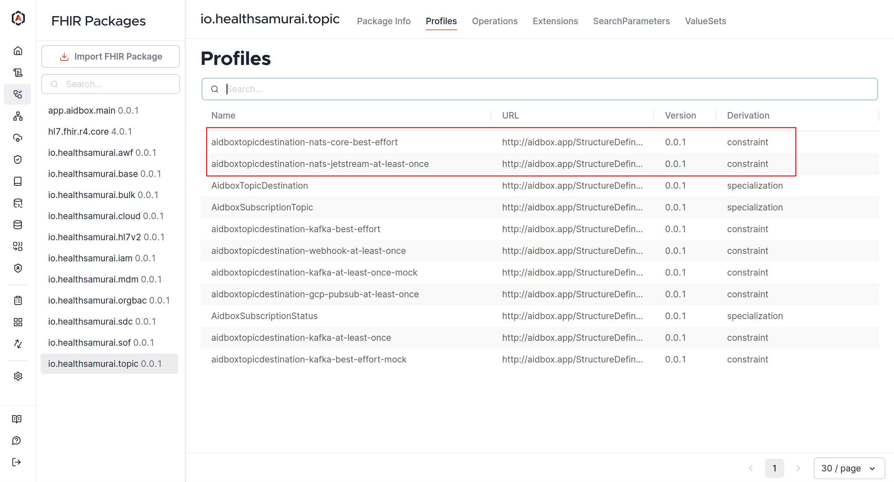

# AidboxTopicSubscription NATS tutorial

## Objectives

* Learn how to integrate [AidboxTopicSubscriptions](../../modules/topic-based-subscriptions/wip-dynamic-subscriptiontopic-with-destinations/README.md) with core NATS / NATS JetStream

## Before you begin
* Make sure your Aidbox version is newer than 2504
* Setup the local Aidbox instance using getting started [guide](../../getting-started/run-aidbox-locally.md)

## What is NATS?

[NATS](https://nats.io/) is a high-performance, open-source messaging broker designed for communication between services and microservices. It provides simple and fast message delivery using the publish/subscribe (pub/sub) pattern and supports various application interaction scenarios.

### JetStream vs Core NATS

Core NATS is a lightweight pub/sub system where messages are delivered to subscribers only at the moment of publishing (best-effort delivery). If a subscriber is offline, the message is lost.

JetStream is an extension of NATS that provides message persistence, replay, and acknowledgment (at least once delivery). It allows you to create streams, store messages, manage consumers, and ensure that important events are not lost even in the case of failure.

In Aidbox, create [AidboxTopicDestination](../../modules/topic-based-subscriptions/wip-dynamic-subscriptiontopic-with-destinations/README.md#aidboxtopicdestination) with `http://aidbox.app/StructureDefinition/aidboxtopicdestination-nats-core-best-effort` profile to integrate with Core NATS and `http://aidbox.app/StructureDefinition/aidboxtopicdestination-nats-jetstream-at-least-once` to integrate with NATS JetStream.

## Setting up

1. Create a directory structure like this:
```
.
├── docker-compose.yaml
├── jetstream/
├── jwt-auth/
└── username-password/
```

```sh
mkdir nats && cd nats
mkdir jetstream
mkdir jwt-auth
mkdir username-password
```

2. Go to the [getting started guide](../../getting-started/run-aidbox-locally.md). Set up and edit **docker-compose.yaml** and add these lines:

```yaml
  aidbox:
    extra_hosts:
    # connect Aidbox container and NATS from localhost
    - "host.docker.internal:host-gateway"
    volumes:
    # module jar to turn on nats support
    - ./topic-destination-nats-2505.2.jar:/topic-destination-nats-2505.2.jar
    # creds used in authentication
    - ./jwt-auth/creds:/creds
    # ...
    environment:
      BOX_MODULE_LOAD: io.healthsamurai.topic-destination.nats.core
      BOX_MODULE_JAR: "/topic-destination-nats-2505.1.jar"
      # ... other envs ...
```

3. Download **.jar** NATS module file from [our bucket](https://console.cloud.google.com/storage/browser/aidbox-modules?authuser=1\&inv=1\&invt=AbwkFA\&pageState=\(%22StorageObjectListTable%22:\(%22f%22:%22%255B%255D%22\)\)) and place it next to **docker-compose.yaml**.

```sh
curl -O https://storage.googleapis.com/aidbox-modules/topic-destination-nats/topic-destination-nats-2505.1.jar
```

4. Install NATS CLIs: **nats-server** and **nsc** using [golang](https://go.dev/doc/install).

```sh
go install github.com/nats-io/nats-server/v2@latest
go install github.com/nats-io/nsc/v2@latest
```

5. Start Aidbox.

```sh
docker compose up
```

Now, in AidboxUI, go to **FHIR Packages -> io.healthsamurai.topic** and make sure that NATS profiles are present.

<figure><figcaption></figcaption></figure>

## Basic Usage

1. Start NATS.

```sh
nats-server
```

2. Subscribe to the `foo` subject.

```sh
nats sub foo
```

3. Check that publishing and subscribing work.

```sh
nats pub foo "Hello, NATS"
```

4. Go to AidboxUI and create a topic that triggers if `Patient.name` exists.

```
POST /fhir/AidboxSubscriptionTopic
content-type: application/json
accept: application/json

{
  "resourceType": "AidboxSubscriptionTopic",
  "url": "patient-topic",
  "status": "active",
  "trigger": [
    {
      "resource": "Patient",
      "fhirPathCriteria": "name.exists()"
    }
  ]
}
```

5. Create **AidboxTopicDestination** with `http://aidbox.app/StructureDefinition/aidboxtopicdestination-nats-core-best-effort` profile.

```
POST /fhir/AidboxTopicDestination
content-type: application/json
accept: application/json

{
  "id": "basic",
  "resourceType": "AidboxTopicDestination",
  "meta": {
    "profile": [
      "http://aidbox.app/StructureDefinition/aidboxtopicdestination-nats-core-best-effort"
    ]
  },
  "kind": "nats-core-best-effort",
  "topic": "patient-topic",
  "parameter": [
    {
      "name": "url",
      "valueString": "nats://host.docker.internal:4222"
    },
    {
      "name": "subject",
      "valueString": "foo"
    },
    {
      "name": "sslContext",
      "valueString": "none"
    }
  ]
}
```

6. Create a patient with a name.

```
POST /fhir/Patient

name:
- family: smith
```

7. See the output in your terminal that the Patient is created.

```
[#3] Received on "foo"
content-type: application/json

{"topic":"foo","value":{"resourceType":"Bundle","type":"history","timestamp":"2025-05-05T09:54:29Z","entry":[{"resource":{"resourceType":"AidboxSubscriptionStatus","status":"active","type":"event-notification","notificationEvent":[{"eventNumber":1,"focus":{"reference":"Patient/5e78f7b8-e6dc-404b-93b5-2356ed1e48b6"}}],"topic":"patient-topic","topic-destination":{"reference":"AidboxTopicDestination/basic"}}},{"request":{"method":"POST","url":"/fhir/Patient"},"fullUrl":"http://localhost:8080/fhir/Patient/5e78f7b8-e6dc-404b-93b5-2356ed1e48b6","resource":{"name":[{"family":"smith"}],"id":"5e78f7b8-e6dc-404b-93b5-2356ed1e48b6","resourceType":"Patient","meta":{"lastUpdated":"2025-05-05T09:54:29.496342Z","versionId":"17","extension":[{"url":"https://aidbox.app/ex/createdAt","valueInstant":"2025-05-05T09:54:29.496342Z"}]}}}]}}
```

## NATS JetStream

1. Change working directory.

```sh
cd jetstream
```

2. Create stream.

```sh
nats stream add EVENTS \
  --subjects="patients.>" \
  --storage=file \
  --defaults
```

2. Publish a message to the stream.

```sh
nats pub patients.test "hello JetStream"
```

3. Check the stream saves the message.

```sh
nats stream ls
```

The output:

```
╭─────────────────────────────────────────────────────────────────────────────╮
│                                   Streams                                   │
├────────┬─────────────┬─────────────────────┬──────────┬──────┬──────────────┤
│ Name   │ Description │ Created             │ Messages │ Size │ Last Message │
├────────┼─────────────┼─────────────────────┼──────────┼──────┼──────────────┤
│ EVENTS │             │ 2025-05-05 13:49:16 │ 1        │ 58 B │ 2.14s        │
╰────────┴─────────────┴─────────────────────┴──────────┴──────┴──────────────╯
```

4. Create **AidboxTopicDestination** with `http://aidbox.app/StructureDefinition/aidboxtopicdestination-nats-jetstream-at-least-once` profile.

```
POST /fhir/AidboxTopicDestination
content-type: application/json
accept: application/json

{
  "resourceType": "AidboxTopicDestination",
  "meta": {
    "profile": [
      "http://aidbox.app/StructureDefinition/aidboxtopicdestination-nats-jetstream-at-least-once"
    ]
  },
  "kind": "nats-jetstream-at-least-once",
  "id": "jetstream",
  "topic": "patient-topic",
  "parameter": [
    {
      "name": "url",
      "valueString": "nats://host.docker.internal:4222"
    },
    {
      "name": "subject",
      "valueString": "patients.created"
    },
    {
      "name": "sslContext",
      "valueString": "none"
    }
  ]
}
```

5. Create a patient.

```
POST /fhir/Patient

name:
- family: smith
```

6. Create a stream consumer.

```sh
nats consumer add EVENTS my-consumer --defaults --pull
```

7. Pull the first available message.

```
nats consumer next EVENTS my-consumer
```

It is our message published from CLI:

```
[13:59:58] subj: patients.test / tries: 1 / cons seq: 1 / str seq: 1 / pending: 1

hello JetStream

Acknowledged message
```

9. Pull next message.

```
nats consumer next EVENTS my-consumer
```

It is the message from Aidbox:the

```
[14:00:21] subj: patients.created / tries: 1 / cons seq: 2 / str seq: 2 / pending: 0

Headers:

  content-type: application/json

Data:


{"topic":"patients.created","value":{"resourceType":"Bundle","type":"history","timestamp":"2025-05-05T10:57:54Z","entry":[{"resource":{"resourceType":"AidboxSubscriptionStatus","status":"active","type":"event-notification","notificationEvent":[{"eventNumber":1,"focus":{"reference":"Patient/598ef035-89f7-4b19-9ad7-fa4ad8f38681"}}],"topic":"patient-topic","topic-destination":{"reference":"AidboxTopicDestination/jetstream"}}},{"request":{"method":"POST","url":"/fhir/Patient"},"fullUrl":"http://localhost:8080/fhir/Patient/598ef035-89f7-4b19-9ad7-fa4ad8f38681","resource":{"name":[{"family":"smith"}],"id":"598ef035-89f7-4b19-9ad7-fa4ad8f38681","resourceType":"Patient","meta":{"lastUpdated":"2025-05-05T10:57:54.908063Z","versionId":"35","extension":[{"url":"https://aidbox.app/ex/createdAt","valueInstant":"2025-05-05T10:57:54.908063Z"}]}}}]}}

Acknowledged message
```

## Username/Password authentication
1. Turn off the previous nats-server (`Ctrl+C`).
2. Change working directory.
```
cd username-password
```
3. Create `nats-server.conf`.
```
port: 4222

authorization {
  users = [
    {
      user: "alice"
      password: "secret1"
      permissions = {
        publish = ["mysubject.>"]
        subscribe = []
      }
    },
    {
      user: "bob"
      password: "secret2"
      permissions = {
        publish = []
        subscribe = ["mysubject.>"]
      }
    }
  ]
}
```
4. Start nats with this config:
```shell
nats-server -c nats-server.conf
```
5. Check that bob can read:
```shell
nats --user bob --password secret2 sub mysubject.hello
```
6. Check that alice can publish:
```shell
nats --user alice --password secret1 pub mysubject.hello "hello from alice"
```
7. Add `username` and `password` properties in `AidboxTopicDestination` resource.
```json
{
  "resourceType": "AidboxTopicDestination",
  "meta": {
    "profile": [
      "http://aidbox.app/StructureDefinition/aidboxtopicdestination-nats-core-best-effort"
    ]
  },
  "kind": "nats-core-best-effort",
  "id": "nats-core-destination",
  "topic": "patient-topic",
  "parameter": [
    {
      "name": "url",
      "valueString": "nats://host.docker.internal:4222"
    },
    {
      "name": "subject",
      "valueString": "mysubject.hello"
    },
    {
      "name": "username",
      "valueString": "alice"
    },
    {
      "name": "password",
      "valueString": "secret1"
    },
    {
      "name": "sslContext",
      "valueString": "none"
    }
  ]
}
```
8. Post the patient with a name.

```
POST /fhir/Patient

name:
- family: smith
```
9. See the output of bob's subscription.

## JWT authentication

1. Turn off the previous nats-server (`Ctrl+C`).
2. Change working directory.

```sh
cd jwt-auth
```

3. Set up NATS operator to use the generated signing key:

```sh
nsc add operator --generate-signing-key --sys --name local

nsc edit operator --require-signing-keys \
  --account-jwt-server-url "nats://localhost:4222"
```

4. Create **APP** account and generate a new signed key for it.

```sh
nsc add account APP
nsc edit account APP --sk generate
```

5. Create **server.conf** and **resolver.conf** files

```sh
nsc generate config --nats-resolver --sys-account SYS > resolver.conf

cat <<- EOF > server.conf
include resolver.conf
EOF
```

Now the server config includes your operator, accounts, and JWT resolver settings.

6. Upload your _APP_ account to the NATS server, so NATS knows what APP is.

```sh
nsc push -a APP
```

7. Create user `joe` and save it in the APP. Joe can publish to subjects that start with "joe".

```sh
nsc add user --account APP joe --allow-pub 'joe.>'

nats context save joe --nsc nsc://local/APP/joe
```

8. Do the same to `pam`. Pam can publish to subjects that start with "pam".

```sh
nsc add user --account APP pam --allow-pub 'pam.>'

nats context save pam --nsc nsc://local/APP/pam
```

9. Create user `admin` that can do everything.

```sh
nsc add user --account APP admin \
  --allow-pub '>' \
  --allow-sub '>'

nats context save admin --nsc nsc://local/APP/admin
```

10. Move creds next to **docker-compose.yaml** file to mount them to use in Aidbox.

```
mkdir -p creds
# make sure the path to creds is right 
cp -r ~/.local/share/nats/nsc/keys/creds/local/APP/* creds
```

11. Start NATS server.

```
nats-server -c server.conf 
```

12. Try to push to `joe.message` using Joe's credentials.

```sh
nats pub joe.message "hello from joe" --context joe
# same thing using --creds
# nats pub joe.message "hello from joe" --creds creds/joe.creds
```

13. Try to push to `pam.message` using Joe's credentials.

```
nats pub pam.message "hello from joe" --context joe
```

Access denied, the error:

```
nats: error: nats: permissions violation: Permissions Violation for Publish to "pam.message"
```

14. Create `joe-to-pam` AidboxTopicDestination. Note that Aidbox, as a Client, has no idea about rights in best-effort mode.

```
POST /fhir/AidboxTopicDestination
content-type: application/json
accept: application/json

{
  "id": "joe-to-pam",
  "resourceType": "AidboxTopicDestination",
  "meta": {
    "profile": [
      "http://aidbox.app/StructureDefinition/aidboxtopicdestination-nats-core-best-effort"
    ]
  },
  "kind": "nats-core-best-effort",
  "topic": "patient-topic",
  "parameter": [
    {
      "name": "url",
      "valueString": "nats://host.docker.internal:4222"
    },
    {
      "name": "subject",
      "valueString": "pam.a"
    },
    {
      "name": "connectionName",
      "valueString": "connectionname"
    },
    {
      "name": "credentialsFilePath",
      "valueString": "/creds/joe.creds"
    },
    {
      "name": "sslContext",
      "valueString": "none"
    }
  ]
}
```

15. Use Joe's credentials to publish to `joe` subject.

```
POST /fhir/AidboxTopicDestination
content-type: application/json
accept: application/json

{
  "id": "joe-to-joe",
  "resourceType": "AidboxTopicDestination",
  "meta": {
    "profile": [
      "http://aidbox.app/StructureDefinition/aidboxtopicdestination-nats-core-best-effort"
    ]
  },
  "kind": "nats-core-best-effort",
  "topic": "patient-topic",
  "parameter": [
    {
      "name": "url",
      "valueString": "nats://host.docker.internal:4222"
    },
    {
      "name": "subject",
      "valueString": "joe.message"
    },
    {
      "name": "connectionName",
      "valueString": "connectionname"
    },
    {
      "name": "credentialsFilePath",
      "valueString": "/creds/joe.creds"
    },
    {
      "name": "sslContext",
      "valueString": "none"
    }
  ]
}
```

16. From your terminal, subscribe to `joe.message` from admin.

```
nats sub joe.message --creds ./creds/admin.creds
```

You can try to subscribe to the subject using Joe's or Pam's credentials, but they do not have the right to do so.

17. Post the patient with a name.

```
POST /fhir/Patient

name:
- family: smith
```

See the output in the terminal.\
The error from **joe-pam** TopicDestination trying to publish without rights:

```
Publish Violation - Nkey "UDVE47SBIUZZM76JDTR6T2RBYF2AANUZH7WTJZYHHZF36GACGXQUGMUF", Subject "pam.a"
```
