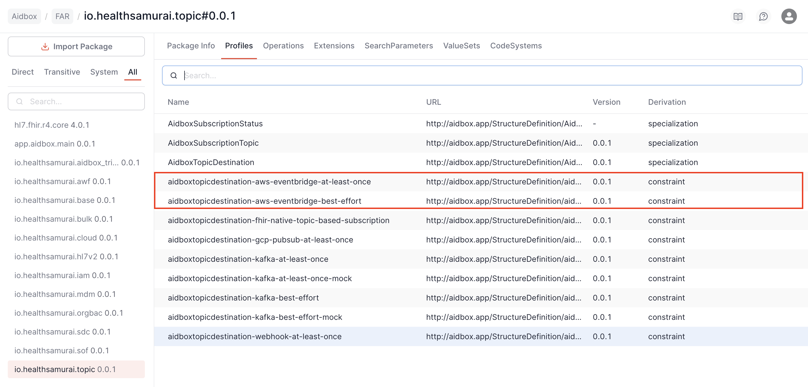

# AidboxTopicSubscription AWS EventBridge tutorial


This functionality is available starting from Aidbox version **2601**.


## Objectives

- Learn how to integrate [AidboxTopicSubscriptions](../../modules/topic-based-subscriptions/aidbox-topic-based-subscriptions.md) with AWS EventBridge

## Before you begin

- Make sure your Aidbox version is **2601** or newer
- Setup the local Aidbox instance using getting started [guide](../../getting-started/run-aidbox-locally.md)

## What is AWS EventBridge?

[AWS EventBridge](https://aws.amazon.com/eventbridge/) is a serverless event bus service that enables you to build event-driven applications. It provides a central hub for receiving, filtering, transforming, and routing events from various sources to AWS services or custom applications.

For detailed information, see the [official EventBridge documentation](https://docs.aws.amazon.com/eventbridge/latest/userguide/eb-what-is.html).

### Key Concepts

**[Event Bus](https://docs.aws.amazon.com/eventbridge/latest/userguide/eb-event-bus.html)** is a router that receives events and delivers them to targets based on rules. EventBridge provides:

- **Default event bus**: Receives events from AWS services
- **Custom event buses**: For your application events (recommended for Aidbox integration)
- **Partner event buses**: For SaaS integrations

**[Events](https://docs.aws.amazon.com/eventbridge/latest/userguide/eb-events.html)** are JSON objects with standard fields:

- `source`: Identifies the event producer (e.g., `aidbox.mycompany.com`)
- `detail-type`: Categorizes events for filtering (e.g., `FHIR Patient Notification`)
- `detail`: The actual payload (FHIR Bundle with subscription notification)

### Best Effort vs At-Least-Once Delivery

In Aidbox, two [AidboxTopicDestination](../../modules/topic-based-subscriptions/aidbox-topic-based-subscriptions.md#aidboxtopicdestination) profiles are supported:

- `http://aidbox.app/StructureDefinition/aidboxtopicdestination-aws-eventbridge-best-effort` — Events are sent immediately. If EventBridge returns an error, the event is lost. Low latency, suitable for non-critical notifications.
- `http://aidbox.app/StructureDefinition/aidboxtopicdestination-aws-eventbridge-at-least-once` — Events are persisted to database before sending. If EventBridge is unavailable, events remain in queue and are retried automatically. Supports batching up to 10 events. Guaranteed delivery for critical integrations.

## Setting up locally

Follow the steps to try AWS EventBridge AidboxTopicSubscription with [LocalStack](https://www.localstack.cloud/) — a local AWS emulator for development and testing.

### 1. Create directory structure

```sh
mkdir eventbridge && cd eventbridge
```

### 2. Configure docker-compose.yaml

Download the getting started [docker-compose.yaml](../../getting-started/run-aidbox-locally.md) and add LocalStack service for local testing:

```yaml
services:
  localstack:
    image: localstack/localstack:latest
    ports:
      - "4566:4566"
    environment:
      - SERVICES=events
      - DEBUG=1

  aidbox:
    # ... existing aidbox configuration ...
    extra_hosts:
      - "host.docker.internal:host-gateway"
    volumes:
      - ./topic-destination-aws-eventbridge-2601.1.jar:/topic-destination-aws-eventbridge.jar
    environment:
      BOX_MODULE_LOAD: io.healthsamurai.topic-destination.eventbridge.core
      BOX_MODULE_JAR: "/topic-destination-aws-eventbridge.jar"
      # ... other envs ...
```

### 3. Download the EventBridge module

```sh
curl -O https://storage.googleapis.com/aidbox-modules/topic-destination-aws-eventbridge/topic-destination-aws-eventbridge-2601.1.jar
```

### 4. Start services

```sh
docker compose up -d
```

### 5. Verify installation

In AidboxUI, go to **FHIR Packages -> io.healthsamurai.topic** and make sure that EventBridge profiles are present:

- `aidboxtopicdestination-aws-eventbridge-best-effort`
- `aidboxtopicdestination-aws-eventbridge-at-least-once`



### 6. Create Event Bus in LocalStack

```sh
aws --endpoint-url=http://localhost:4566 events create-event-bus --name test-bus
```

To verify:

```sh
aws --endpoint-url=http://localhost:4566 events list-event-buses
```

## Basic Usage (Best Effort)

### 1. Create a subscription topic

```
POST /fhir/AidboxSubscriptionTopic
content-type: application/json
accept: application/json

{
  "resourceType": "AidboxSubscriptionTopic",
  "url": "patient-topic",
  "status": "active",
  "trigger": [
    {
      "resource": "Patient",
      "fhirPathCriteria": "name.exists()"
    }
  ]
}
```

### 2. Create AidboxTopicDestination

```
POST /fhir/AidboxTopicDestination
content-type: application/json
accept: application/json

{
  "id": "eventbridge-destination",
  "resourceType": "AidboxTopicDestination",
  "meta": {
    "profile": [
      "http://aidbox.app/StructureDefinition/aidboxtopicdestination-aws-eventbridge-best-effort"
    ]
  },
  "kind": "aws-eventbridge-best-effort",
  "topic": "patient-topic",
  "parameter": [
    {
      "name": "eventBusName",
      "valueString": "test-bus"
    },
    {
      "name": "region",
      "valueString": "us-east-1"
    },
    {
      "name": "source",
      "valueString": "aidbox.mycompany.com"
    },
    {
      "name": "detailType",
      "valueString": "FHIR Patient Notification"
    },
    {
      "name": "accessKeyId",
      "valueString": "test"
    },
    {
      "name": "secretAccessKey",
      "valueString": "test"
    },
    {
      "name": "endpointOverride",
      "valueString": "http://host.docker.internal:4566"
    }
  ]
}
```

### 3. Create a Patient

```
POST /fhir/Patient
content-type: application/json

{
  "name": [{"family": "Smith", "given": ["John"]}]
}
```

### 4. Verify event delivery

Check the topic destination status:

```
GET /fhir/AidboxTopicDestination/eventbridge-destination/$status
```

Response:

```json
{
  "resourceType": "Parameters",
  "parameter": [
    { "name": "messagesDelivered", "valueDecimal": 1 },
    { "name": "messagesDeliveryAttempts", "valueDecimal": 0 },
    { "name": "messagesInProcess", "valueDecimal": 0 },
    { "name": "messagesQueued", "valueDecimal": 0 },
    { "name": "startTimestamp", "valueDateTime": "2025-05-05T10:00:00Z" },
    { "name": "status", "valueString": "active" }
  ]
}
```

#### View events in LocalStack

To verify events are actually delivered to EventBridge, create an SQS queue as a target:

```sh
# Create rule to capture all events
aws --endpoint-url=http://localhost:4566 events put-rule \
  --name "log-all" \
  --event-bus-name "test-bus" \
  --event-pattern '{"source": [{"prefix": ""}]}'

# Create SQS queue
aws --endpoint-url=http://localhost:4566 sqs create-queue --queue-name test-queue

# Add SQS as target
aws --endpoint-url=http://localhost:4566 events put-targets \
  --rule "log-all" \
  --event-bus-name "test-bus" \
  --targets "Id"="1","Arn"="arn:aws:sqs:us-east-1:000000000000:test-queue"

# Receive messages
aws --endpoint-url=http://localhost:4566 sqs receive-message \
  --queue-url http://localhost:4566/000000000000/test-queue
```

## At-Least-Once with Batching

For guaranteed delivery with batch processing, use the at-least-once profile:

```
POST /fhir/AidboxTopicDestination
content-type: application/json
accept: application/json

{
  "id": "eventbridge-reliable",
  "resourceType": "AidboxTopicDestination",
  "meta": {
    "profile": [
      "http://aidbox.app/StructureDefinition/aidboxtopicdestination-aws-eventbridge-at-least-once"
    ]
  },
  "kind": "aws-eventbridge-at-least-once",
  "topic": "patient-topic",
  "parameter": [
    {
      "name": "eventBusName",
      "valueString": "test-bus"
    },
    {
      "name": "region",
      "valueString": "us-east-1"
    },
    {
      "name": "source",
      "valueString": "aidbox.mycompany.com"
    },
    {
      "name": "detailType",
      "valueString": "FHIR Patient Notification"
    },
    {
      "name": "accessKeyId",
      "valueString": "test"
    },
    {
      "name": "secretAccessKey",
      "valueString": "test"
    },
    {
      "name": "endpointOverride",
      "valueString": "http://host.docker.internal:4566"
    },
    {
      "name": "batchSize",
      "valueInteger": 10
    }
  ]
}
```

The `batchSize` parameter (1-10) controls how many events are sent in a single [PutEvents API](https://docs.aws.amazon.com/eventbridge/latest/userguide/eb-putevents.html) call. EventBridge allows [maximum 10 entries per request](https://docs.aws.amazon.com/eventbridge/latest/userguide/eb-quota.html).

## Configuration Reference

### Available Parameters

| Parameter          | Type         | Required | Description                                                       |
| ------------------ | ------------ | -------- | ----------------------------------------------------------------- |
| `eventBusName`     | valueString  | Yes      | Event Bus name or ARN (`default`, `my-bus`, or full ARN)          |
| `region`           | valueString  | Yes      | AWS region (`us-east-1`, `eu-west-1`, etc.)                       |
| `source`           | valueString  | Yes      | Event source identifier for routing rules                         |
| `detailType`       | valueString  | Yes      | Event type for filtering in EventBridge rules                     |
| `accessKeyId`      | valueString  | No       | AWS Access Key ID (uses default credential chain if not provided) |
| `secretAccessKey`  | valueString  | No       | AWS Secret Access Key                                             |
| `endpointOverride` | valueString  | No       | Override endpoint URL (for LocalStack: `http://localhost:4566`)   |
| `batchSize`        | valueInteger | No       | Events per batch, 1-10 (at-least-once only, default: 1)           |

### Event Format

Events sent to EventBridge have this structure:

```json
{
  "source": "aidbox.mycompany.com",
  "detail-type": "FHIR Patient Notification",
  "detail": {
    "topic": "patient-topic",
    "value": {
      "resourceType": "Bundle",
      "type": "history",
      "timestamp": "2025-05-05T10:00:00Z",
      "entry": [
        {
          "resource": {
            "resourceType": "AidboxSubscriptionStatus",
            "status": "active",
            "type": "event-notification",
            "notificationEvent": [
              {
                "eventNumber": 1,
                "focus": { "reference": "Patient/123" }
              }
            ],
            "topic": "patient-topic",
            "topic-destination": {
              "reference": "AidboxTopicDestination/eventbridge-destination"
            }
          }
        },
        {
          "request": { "method": "POST", "url": "/fhir/Patient" },
          "fullUrl": "http://localhost:8080/fhir/Patient/123",
          "resource": {
            "resourceType": "Patient",
            "id": "123",
            "name": [{ "family": "Smith", "given": ["John"] }]
          }
        }
      ]
    }
  },
  "event-bus-name": "test-bus"
}
```

## AWS Authentication

### Option 1: Access Keys (for development)

Provide `accessKeyId` and `secretAccessKey` parameters directly in the AidboxTopicDestination.

### Option 2: IAM Role (recommended for production)

When running on AWS (EC2, ECS, EKS), omit `accessKeyId` and `secretAccessKey`. The module will use the default AWS credential chain:

1. Environment variables (`AWS_ACCESS_KEY_ID`, `AWS_SECRET_ACCESS_KEY`)
2. Web Identity Token (for EKS)
3. EC2/ECS Instance Profile

Required IAM permissions:

```json
{
  "Version": "2012-10-17",
  "Statement": [
    {
      "Effect": "Allow",
      "Action": "events:PutEvents",
      "Resource": "arn:aws:events:*:*:event-bus/your-bus-name"
    }
  ]
}
```

## Creating EventBridge Rules

[EventBridge Rules](https://docs.aws.amazon.com/eventbridge/latest/userguide/eb-rules.html) define how events are routed to targets. To route events from EventBridge to targets, create rules in the AWS Console or via CLI:

```sh
aws events put-rule \
  --name "patient-notifications" \
  --event-bus-name "test-bus" \
  --event-pattern '{
    "source": ["aidbox.mycompany.com"],
    "detail-type": ["FHIR Patient Notification"]
  }'

aws events put-targets \
  --rule "patient-notifications" \
  --event-bus-name "test-bus" \
  --targets "Id"="1","Arn"="arn:aws:sqs:us-east-1:123456789:patient-queue"
```

## Monitoring

### Status Endpoint

```
GET /fhir/AidboxTopicDestination/{id}/$status
```

### Response Parameters

| Parameter                  | Description                                  |
| -------------------------- | -------------------------------------------- |
| `messagesDelivered`        | Total successfully delivered events          |
| `messagesDeliveryAttempts` | Failed delivery attempts                     |
| `messagesInProcess`        | Events currently being sent                  |
| `messagesQueued`           | Events waiting in queue (at-least-once only) |
| `startTimestamp`           | Destination start time                       |
| `status`                   | Always `active`                              |
| `lastErrorDetail`          | Recent error information                     |

### Prometheus Metrics

```
GET /metrics
```

Metrics include:

- `aidbox_topic_destination_messages_delivered`
- `aidbox_topic_destination_messages_queued`
- `aidbox_topic_destination_messages_in_process`

## Set up with AWS

### Prerequisites

1. AWS account with EventBridge access
2. AWS CLI configured: `aws configure`
3. IAM user/role with `events:PutEvents` permission

### Step 1: Create Event Bus

```sh
aws events create-event-bus --name aidbox-events --region us-east-1
```

### Step 2: Create SQS Queue for Testing

Create a queue to receive events (for verification):

```sh
aws sqs create-queue --queue-name aidbox-test-queue --region us-east-1
```

### Step 3: Create EventBridge Rule

Route events to the SQS queue:

```sh
# Create rule
aws events put-rule \
  --name "aidbox-to-sqs" \
  --event-bus-name "aidbox-events" \
  --event-pattern '{"source": ["aidbox.mycompany.com"]}' \
  --region us-east-1

# Get SQS ARN
SQS_ARN=$(aws sqs get-queue-attributes \
  --queue-url https://sqs.us-east-1.amazonaws.com/YOUR_ACCOUNT_ID/aidbox-test-queue \
  --attribute-names QueueArn \
  --query 'Attributes.QueueArn' \
  --output text \
  --region us-east-1)

# Add SQS as target (requires SQS policy to allow EventBridge)
aws events put-targets \
  --rule "aidbox-to-sqs" \
  --event-bus-name "aidbox-events" \
  --targets "Id"="1","Arn"="$SQS_ARN" \
  --region us-east-1
```

### Step 4: Configure SQS Policy

Allow EventBridge to send messages to SQS:

```sh
aws sqs set-queue-attributes \
  --queue-url https://sqs.us-east-1.amazonaws.com/YOUR_ACCOUNT_ID/aidbox-test-queue \
  --attributes '{
    "Policy": "{\"Version\":\"2012-10-17\",\"Statement\":[{\"Effect\":\"Allow\",\"Principal\":{\"Service\":\"events.amazonaws.com\"},\"Action\":\"sqs:SendMessage\",\"Resource\":\"arn:aws:sqs:us-east-1:YOUR_ACCOUNT_ID:aidbox-test-queue\"}]}"
  }' \
  --region us-east-1
```

### Step 5: Create AidboxTopicDestination

```json
POST /fhir/AidboxTopicDestination
content-type: application/json

{
  "id": "eventbridge-aws",
  "resourceType": "AidboxTopicDestination",
  "meta": {
    "profile": [
      "http://aidbox.app/StructureDefinition/aidboxtopicdestination-aws-eventbridge-at-least-once"
    ]
  },
  "kind": "aws-eventbridge-at-least-once",
  "topic": "patient-topic",
  "parameter": [
    {"name": "eventBusName", "valueString": "aidbox-events"},
    {"name": "region", "valueString": "us-east-1"},
    {"name": "source", "valueString": "aidbox.mycompany.com"},
    {"name": "detailType", "valueString": "FHIR Patient Notification"},
    {"name": "accessKeyId", "valueString": "AKIA..."},
    {"name": "secretAccessKey", "valueString": "..."}
  ]
}
```

### Step 6: Test and Verify

1. Create a Patient in Aidbox
2. Check SQS for received messages:

```sh
aws sqs receive-message \
  --queue-url https://sqs.us-east-1.amazonaws.com/YOUR_ACCOUNT_ID/aidbox-test-queue \
  --region us-east-1
```

## Related Documentation

### Aidbox

- [Topic-based Subscriptions](../../modules/topic-based-subscriptions/aidbox-topic-based-subscriptions.md)
- [AidboxTopicDestination](../../modules/topic-based-subscriptions/aidbox-topic-based-subscriptions.md#aidboxtopicdestination)

### AWS EventBridge

- [What is Amazon EventBridge?](https://docs.aws.amazon.com/eventbridge/latest/userguide/eb-what-is.html)
- [Amazon EventBridge Event Buses](https://docs.aws.amazon.com/eventbridge/latest/userguide/eb-event-bus.html)
- [Amazon EventBridge Events](https://docs.aws.amazon.com/eventbridge/latest/userguide/eb-events.html)
- [Sending Events with PutEvents](https://docs.aws.amazon.com/eventbridge/latest/userguide/eb-putevents.html)
- [Amazon EventBridge Rules](https://docs.aws.amazon.com/eventbridge/latest/userguide/eb-rules.html)
- [Amazon EventBridge Targets](https://docs.aws.amazon.com/eventbridge/latest/userguide/eb-targets.html)
- [Amazon EventBridge Quotas](https://docs.aws.amazon.com/eventbridge/latest/userguide/eb-quota.html)
- [PutEvents API Reference](https://docs.aws.amazon.com/eventbridge/latest/APIReference/API_PutEvents.html)
