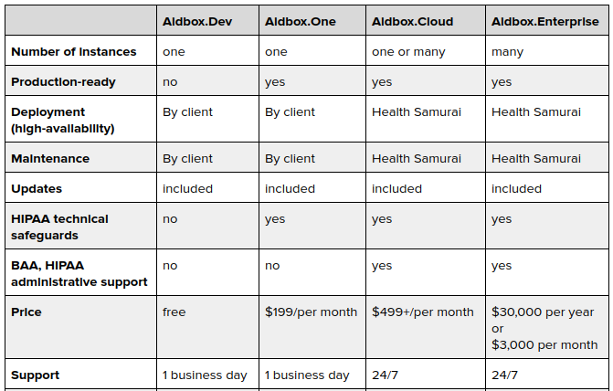
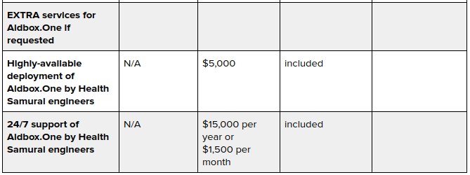

# Editions & Pricing

Aidbox is available in the following editions:

**Aidbox.Dev** is a free development environment.  It is good for developers starting new healthcare projects. Download Aidbox Dev and set up your development environment in no time.  
  
**Aidbox.One** is a one-server installation. It is good for small production installations. Upgrade your Aidbox Dev to Aidbox One and move your solution into production.   
  
**Aidbox.Enterprise** is a highly-available multi-tenant installation with 24/7 support. It is good for large enterprise installations and SaaS products.  
  
**Aidbox.Cloud** is Aidbox.Enterprise in Health Samurai cloud. It is good for everyone! Use what you need and pay for what you use.

