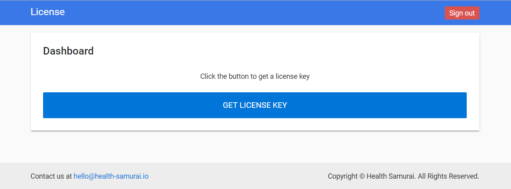

# 🎓 Setup Devbox

## Overview

Devbox is compatible with macOS, Linux, and Windows 10 Pro.

**Devbox** is a lightweight version of [Aidbox](https://www.health-samurai.io/aidbox). It is a special version aimed at local development and in your CI. To obtain Devbox license, please use our [License server](https://license-ui.aidbox.app/).

## License obtaining

1. Visit and register on the [License server](https://license-ui.aidbox.app), then click the `GET LICENSE KEY` button.



1. Enter a short description of your project and select the `Devbox` option.


1. Congratulations! Now you have a license key.


## Devbox Installation

### Step 1. Install Docker Compose

The recommended way to work with **Devbox** is [Docker Compose](https://docs.docker.com/compose/).  
Install Docker for your OS following the [Get Docker page](https://docs.docker.com/install/), then follow the instructions on the [installing Compose](https://docs.docker.com/compose/install/#install-compose) page.

### Step 2. Create docker-compose.yaml

Clone the[ official repository](https://github.com/Aidbox/devbox) with the sample configuration.

```bash
$ git clone https://github.com/Aidbox/devbox.git
```

Create the .env file with your Devbox parameters.

```text
$ cd devbox && cp .env.tpl .env
```


docker-compose.yaml file is parameterized with environment variables that can be stored by convention in the .env file \(read more about [env & docker-compose](https://docs.docker.com/compose/environment-variables/)\).



```yaml
version: '3.1'
services:
  devbox:
    image: "${AIDBOX_IMAGE}"
    depends_on:
      - "devbox-db"
    links:
      - "devbox-db:database"
    ports:
      - "${AIDBOX_PORT}:${AIDBOX_PORT}"
    env_file:
      - .env
    environment:
      PGHOST: database
  devbox-db:
    image: "${PGIMAGE}"
    ports:
      - "${PGHOSTPORT}:${PGPORT}"
    volumes:
    - "./pgdata:/data"
    environment:
      POSTGRES_USER:     "${PGUSER}"
      POSTGRES_PASSWORD: "${PGPASSWORD}"
      POSTGRES_DB:       "${PGDATABASE}"
```


### Step 3. **Fill in the .env file with the following parameters**

Open the `.env` file and insert your `License ID` and `License KEY,` specify FHIR version and decide on the box security and distribution channel \( latest vs edge\).


```bash
AIDBOX_LICENSE_ID=<your-license-id>
AIDBOX_LICENSE_KEY=<your-license-key>

AIDBOX_CLIENT_ID=root
AIDBOX_CLIENT_SECRET=secret

AIDBOX_ADMIN_ID=admin
AIDBOX_ADMIN_PASSWORD=secret

AIDBOX_PORT=8888
AIDBOX_FHIR_VERSION=4.0.0

PGPORT=5432
PGHOSTPORT=5437
PGUSER=postgres
PGPASSWORD=postgres
PGDATABASE=devbox

PGIMAGE=healthsamurai/aidboxdb:13.2

AIDBOX_IMAGE=healthsamurai/devbox:latest
# uncomment next line to work with edge channel
# AIDBOX_IMAGE=healthsamurai/devbox:edge
```


| Variable | required | Desc |
| :--- | :--- | :--- |
| AIDBOX\_LICENSE\_ID | true | Your license ID |
| AIDBOX\_LICENSE\_ID | true | Your license key |
| AIDBOX\_CLIENT\_ID | false | Root Client ID \* \(default: root\) |
| AIDBOX\_CLIENT\_SECRET | false | Root Client Secret \* |
| AIDBOX\_PORT | true | Port number to access Aidbox backend |
| AIDBOX\_BASE\_URL | false | When specified, all relative links to resources will be replaced with absolute links including the base URL |
| AIDBOX\_FHIR\_VERSION | true | Version of FHIR - 1.0.2, 1.4.0, 1.8.0, 3.0.1, 3.2.0, 3.3.0, 4.0.0; Currently 4.0.0 is recommended version. |
| AIDBOX\_IMAGE | true | can be specific image tag or one of :edge or :latest |
| AIDBOX\_ADMIN\_ID | false | Id for admin user \(default: admin\) |
| AIDBOX\_ADMIN\_PASSWORD | false | Password for admin user |

Please, find the full list of available environment variables [here](https://docs.aidbox.app/getting-started/installation/use-devbox-aidbox).


If **AIDBOX\_CLIENT\_ID** & **AIDBOX\_CLIENT\_SECRET** are provided - Aidbox will start in a secure mode with access control turned on; API Client with provided ID and secret will be created, as well as the Access Policy, which grants root privileges to this Client. In the simpliest way, you can access Aidbox API using basic auth and this client credentials.



Starting Aidbox in an open mode without AIDBOX\_CLIENT\_SECRET is disabled!



**AIDBOX\_IMAGE** specifies one of the images from **healthsamurai/devbox** repository. Take a look at available versions at [docker hub](https://hub.docker.com/r/healthsamurai/devbox/tags).


## Run Devbox

### **Run Docker Compose**

```bash
$ docker-compose up -d
```

That's it! Devbox is running and you can point your browser to [http://localhost:8888](http://localhost:8888/) to see a fancy welcome page.

\_\*\*\_Input your ADMIN\_ID and ADMIN\_PASSWORD and you will see your development environment. This is the way to create your best healthcare products.



We welcome your questions and comments about our products. Have an idea/question you'd like to share with our community? [Submit it here](https://t.me/aidbox)


## What next?

Learn how to obtain access to the [REST API](https://docs.aidbox.app/api-1/api) by the link below.



## Advanced tips

You can test your docker-compose.yaml with

```bash
docker-compose config # to inspect your configuration
```

You can access your PostgreSQL on localhost using $PGUSER and $PGPASSWORD from env variables on $PGHOSTPORT .

```bash
# source variables
$ set -o allexport && source .env && set +o allexport
# run psql
$ psql -h localhost -p $PGHOSTPORT
psql (10.3, server 11.1)
Type "help" for help.

devbox=# \dt
```

Or you can do it in the db container:

```bash
$ docker-compose exec devbox-db psql devbox
psql (11.1)
Type "help" for help.

devbox=#
```

Inspect Aidbox logs:

```bash
$ docker-compose logs -f devbox
```

Use curl to access API

```bash
$ curl localhost:$AIDBOX_PORT/\$metadata?_format=yaml
{message: Access Denied}
# ups box is secured
$ curl -u $AIDBOX_CLIENT_ID:$AIDBOX_CLIENT_SECRET \
  localhost:$AIDBOX_PORT/\$metadata?_format=yaml | less
```


Be careful with the **$** sign in url paths \(aka **/$metadata**\) in the shell - you have to escape it \( **/$metadata**\); otherwise, the shell will try to interpret it as variables ;\)


### Stop Devbox

```bash
$ docker-compose stop
```

### Destroy Devbox

```bash
$ docker-compose down
```

By default, docker-compose file mount folder `./pgdata` as a persistent volume for PostgreSQL so that it survives restarts and destruction of containers. To clean up the previous installation completely: `rm -rf ./pgdata`

### Upgrade Devbox

`make update` command updates all project services including dependencies.

```text
update:
	docker-compose pull
	docker-compose up -d
```

### PGIMAGE

[aidbox/db](https://hub.docker.com/r/healthsamurai/aidboxdb/tags?page=1&ordering=last_updated) is a custom compiled Postgres which is bundled with extensions necessary for the Aidbox.  
One of these extensions is the [jsonknife](https://github.com/niquola/jsonknife), it provides a set of functions used in FHIR search API implementation. If your Postgres image is missing the jsonknife extension, then Aidbox will try to use other tools to implement jsonknife functionality. Fallback will happen in such order: jsonpath, ~~plv8~~, pure PostgreSQL. Keep in mind that alternative implementations have lower performance  
_2021-04-09: plv8 jsonknife engine has been deprecated_

