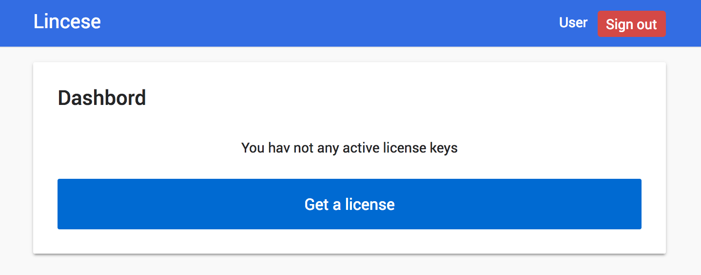
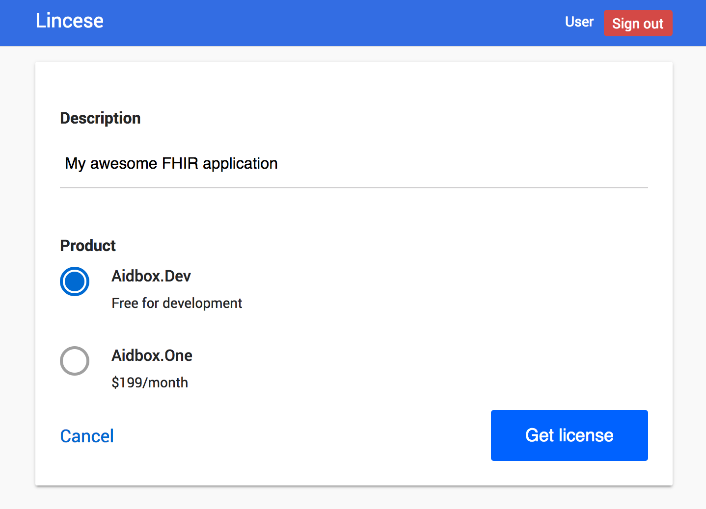
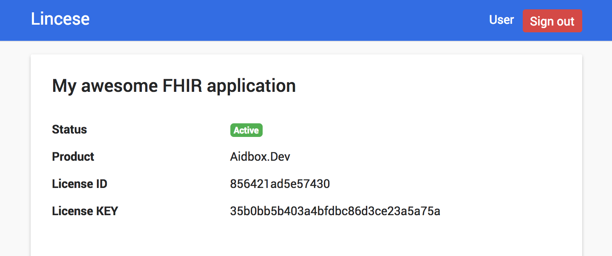

# Setup Aidbox.Dev

### Requirements

* [docker](https://docs.docker.com/install/)
* [docker-compose](https://docs.docker.com/compose/install/)

### License obtaining

1. Visit and register on [License server ](https://license-ui.aidbox.app), and press "Get a license".



2. Enter short description of license key and choice "Aidbox.Dev"  product.



3. Congratulation, now you have license key.



### Start Aidbox.Dev

Clone our official documentation repository with applications samples and installation instructions

```text
$ git clone https://github.com/Aidbox/devbox.git
```

Go to cloned directory

```text
$ cd devbox
```

Open `license.env` and insert into file your `License ID` and `License KEY` . Or download and move you `license.env` file in to devbox root folder



```text
DEVBOX_LICENSE_ID=856421ad5e57430
DEVBOX_LICENSE_KEY=35b0bb5b403a4bfdbc86d3ce23a5a75a
```



After that run DevBox

```bash
$ docker-compose up
```

That's it! Aidbox.Dev is running and you can point your browser to [http://localhost:8888/](http://localhost:8888/) to see fancy welcome page.

