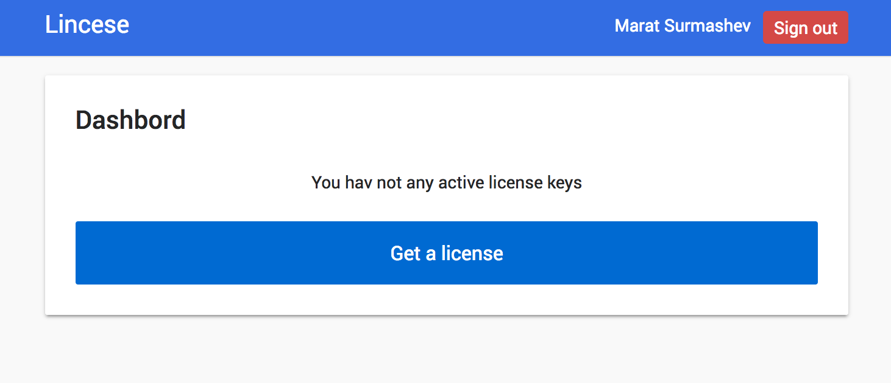
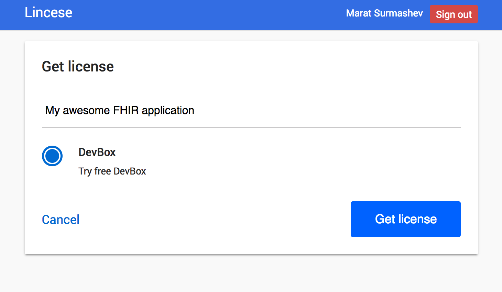
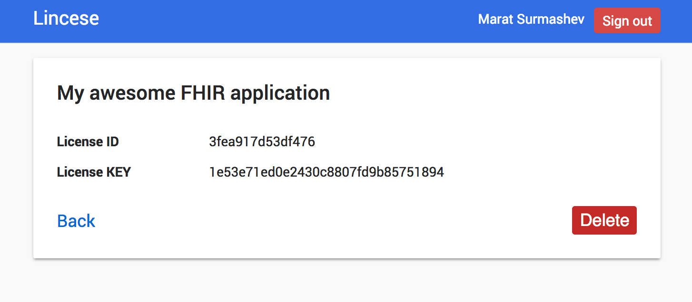

# Setup aidbox.dev

### Requirements

* [docker](https://docs.docker.com/install/)
* [docker-compose](https://docs.docker.com/compose/install/)

### License obtaining

1. Visit and register on [License server ](https://license-ui.aidbox.app), and press "Get a license"



2. Enter short description of license key and choice "DevBox"  



3. Congratulation, now you have license key



### Start DevBox

Clone our official documentation repository with applications samples and installation instructions

```text
$ git clone https://github.com/Aidbox/devbox.git
```

Go to cloned directory

```text
$ cd devbox
```

Open `license.env` and insert into file your `License ID` and `License KEY`



```text
DEVBOX_LICENSE_ID=3fea917d53df476
DEVBOX_LICENSE_KEY=1e53e71ed0e2430c8807fd9b85751894
```



After that run DevBox

```bash
$ docker-compose up
```

That's it! Devbox is running and you can point your browser to [http://localhost:8888/](http://localhost:8888/) to see fancy welcome page.

