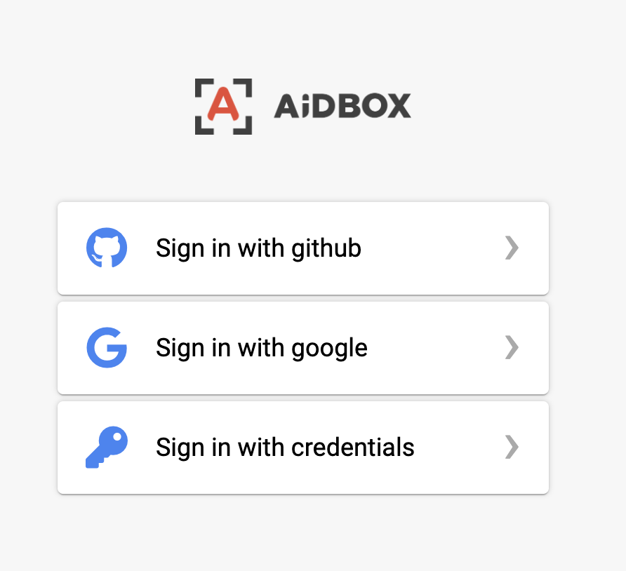
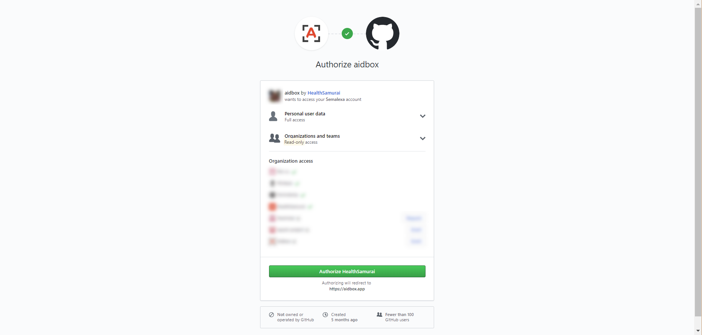
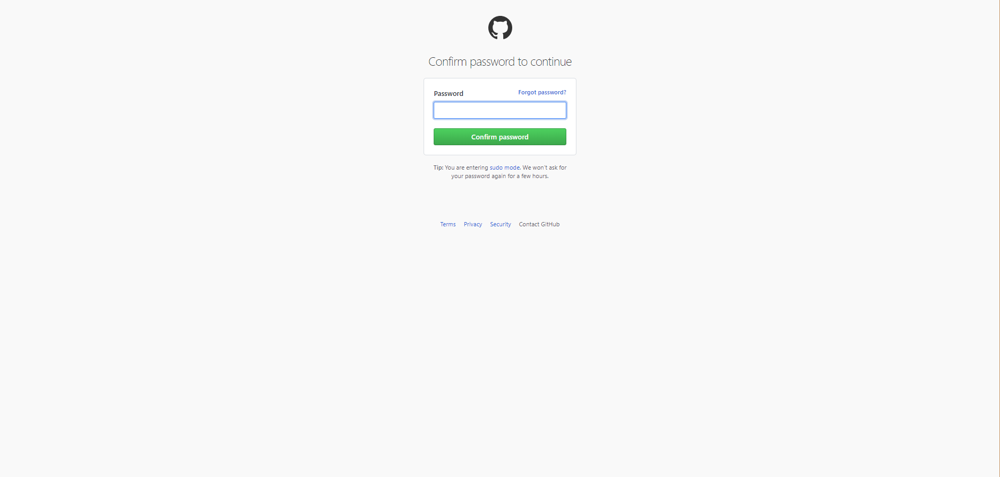
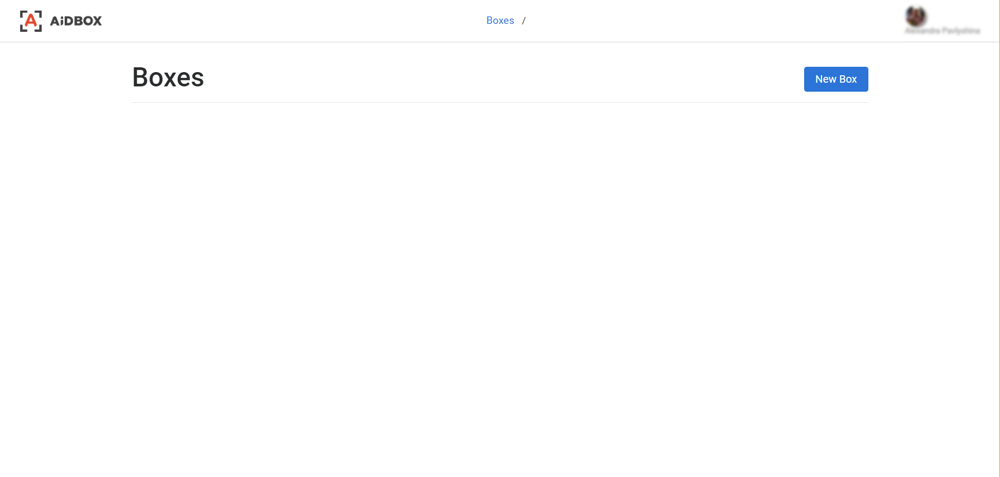
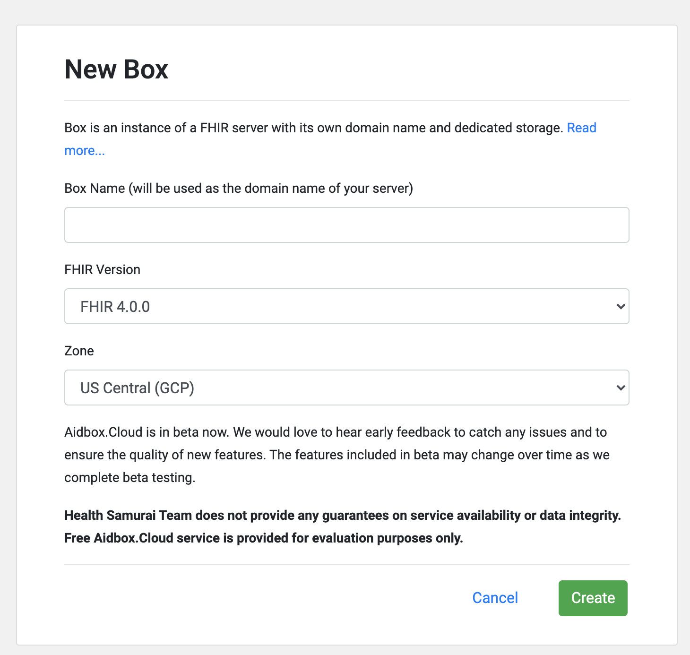
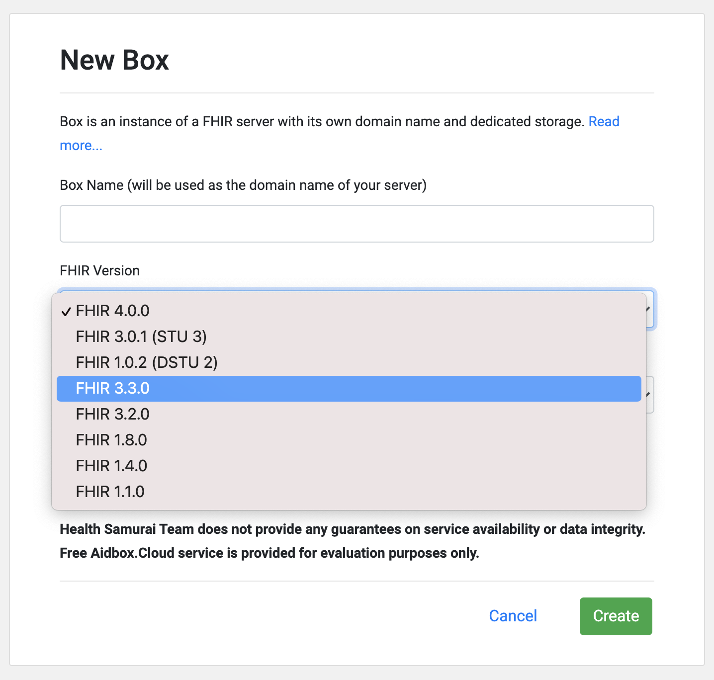
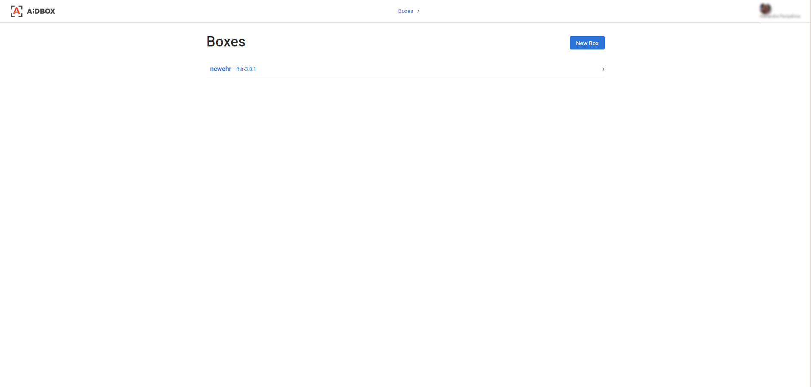
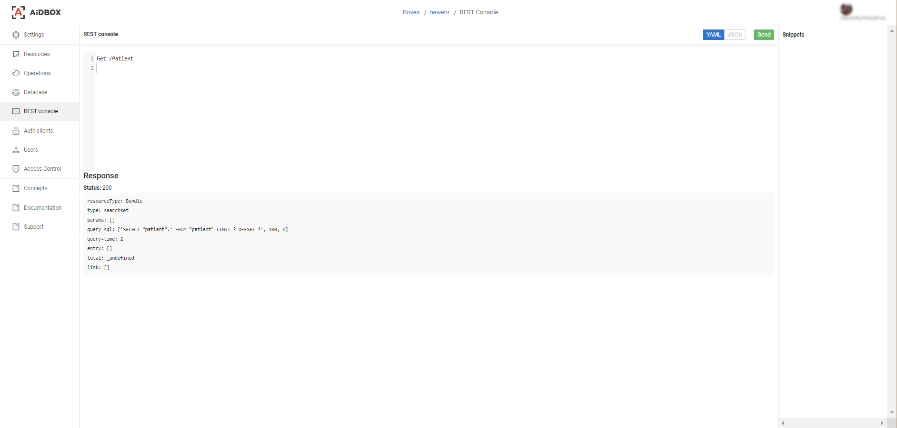

# 🎓 Use Aidbox.Cloud

Aidbox.Could is a sandbox version of Aidbox in HealthSamurai cloud. Each Box is a private instance of a FHIR server with a separate database and domain. You can create multiple boxes for testing and evaluation.

Please, pay attention, that the sandbox environment doesn't fit for any kind of production usage. The service availability and data integrity are not guaranteed. Do not put any PHI data there.

To try out Aidbox.Cloud, open [https://aidbox.app/](https://aidbox.app/) 

Choose how you would like to authorize Aidbox. It can be done via your Github or Google account.

If you chose Github authorization, click the 'Authorize HealthSamurai' button.

Github will ask you to confirm your password to continue.

And now you are successfully authorized in Aidbox.Cloud. Click the 'New Box' button to start.

In the displayed form, enter your future box name. It can be a name of your application you are going to build. It will be the base URL of your FHIR server.

Choose the desired FHIR version, and click the 'Create' button.

Your new box will be successfully created. Click the box name to proceed.

Now you can browse the left navigation menu and work with your box and its database. What you can do here: 

* Settings — view your box settings, base URL, manage your collaborators.
* Resources — view the list of available resources.
* Operations — view the list of available operations.
* Database — work with your database.
* REST console — execute REST requests to your box.
* Auth clients — manage your auth clients.
* Users — manage your box users.
* Access Control — manage access to your box.
* Concepts — view the list of available concepts.
* Documentation — redirects you to the [docs.aidbox.app](https://docs.aidbox.app) site with documentation.
* Support — this is a modal form to send a feedback.

Let's execute the GET request reading all Patient resources. Access the REST console, enter 'Get /Patient' and press CTRL+Enter. You will see the response.

