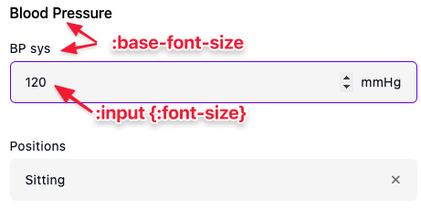

# Form customisation

Aidbox Forms gives you ability to customize form looking. To do this you can create a new theme, and specify it in sdc-service.

The simplest variant of forms theme looks like this:

```clojure
simplest-sdc-theme
{:zen/tags #{aidbox.sdc/theme}
 :zen/desc "Default SDC theme"
 :main-color [120 38 245]}
```

> Each color in theme represented as vector with three RGB channels: \[<mark style="color:red;">RED</mark> <mark style="color:green;">GREEN</mark> <mark style="color:blue;">BLUE</mark>]

To use this theme specify `simplest-sdc-theme` under the `:theme` key in SDC service.

In this theme we change only main-color, but this color changes a lot in Aidbox Forms looking: inputs border color, buttons background color, etc. So you can use just one key to style forms with your brand color.

If you need more detailed styling, you can use extended theme definition. With this you can change separately buttons main color, text color, input border, background, text colors, background colors, font and add a brand image.

### Buttons

To change buttons appearance add to theme scheme a new map under `:button` key:

```clojure
buttons-sdc-theme
{:zen/tags #{aidbox.sdc/theme}
 :zen/desc "Default SDC theme"
 :main-color [120 38 245]
 :button {:text-color [0 94 184]
          :accent-color [255 255 255]}}
```

For filled buttons accent color will be used as background color, for outlined buttons as border color and text color.

Also you can change text of `Save & Close` and `Submit` buttons.

> Read more about [`Save & Close button`](../../../reference/aidbox-forms/api-reference.md#aidbox.sdc-generate-form-link)

```clojure
buttons-sdc-theme
{:zen/tags #{aidbox.sdc/theme}
 :zen/desc "Default SDC theme"
 :main-color [120 38 245]
 :button {:redirect-text "Close"
          :submit-text "Sign"
	      :text-color [0 94 184]
          :accent-color [255 255 255]}}
```

### Inputs

To change inputs appearance add to theme scheme a new map under `:input` key:

```
inputs-sdc-theme
{:zen/tags #{aidbox.sdc/theme}
 :zen/desc "Theme styled with NHS colors"
 :main-color [0 94 184]
 :input {:accent-color [0 94 184]
         :text-color [35 31 32]
         :background-color [232 237 238]}}
```

Here accent color will be used as border color on hover, focused state.

### Background colors

Also you can change background colors:

```clojure
background-sdc-theme
{:zen/tags #{aidbox.sdc/theme}
 :zen/desc "Theme styled with NHS colors"
 :main-color [0 94 184]
 :background {:main-color [232 237 238]
              :form-color [255 255 255]
              :toolbar-color [118 134 146]}}
```

To understand what each color is look at the image below:

<figure><figcaption></figcaption></figure>

### Font

To change font specify the `:font-family` in theme scheme. Currently we support fonts only from this list, but we continue to add support for other fonts:

* Inter
* Product Sans
* Gotham Pro

```clojure
font-sdc-theme
{:zen/tags #{aidbox.sdc/theme}
 :zen/desc "Theme styled with NHS colors"
 :main-color [0 94 184]
 :font-family "Product Sans"}
```

### Brand images

You can add brand image or logo of your company by adding a new map under the key `:brand-image` and specify the location and the URL to image:

```clojure
brand-image-theme
{:zen/tags #{aidbox.sdc/theme}
 :zen/desc "Theme styled with NHS colors"
 :main-color [0 94 184]
 :brand-image {:top-right {:url "..."}
               :bottom-left {:url "...}}}
```

Your images will be placed as following:

<figure><figcaption></figcaption></figure>

So full theme could look like this:

```clojure
nhs-sdc-theme
{:zen/tags #{aidbox.sdc/theme}
 :zen/desc "Theme styled with NHS colors"
 :main-color [0 94 184]
 :font-family "Gotham Pro"
 :brand-image {:top-right {:url "...."}
               :bottom-left {:url "...."}}
 :background {:main-color [232 237 238]
              :form-color [255 255 255]
              :toolbar-color [118 134 146]}
 :input {:accent-color [0 94 184]
         :text-color [35 31 32]
         :background-color [232 237 238]}
 :button {:accent-color [0 94 184]
          :text-color [255 255 255]}}
```

## How to change font size

To change font size, we have two settings in theme:

* `:base-font-size`
* `:input {:font-size}`

First settings will modify field labels, sections titles, etc. The second will modify font size in inputs.

<figure><figcaption></figcaption></figure>

```clojure
font-theme
{:zen/tags #{aidbox.sdc/theme}
 :zen/desc "Theme with font sizes modified"
 :base-font-size "16px"
 :input {:font-size "18px"}}
```

## How to display one form with different themes

Theme that you specify in sdc-service is default theme. You can specify theme for each form individually.

In the link that you share with users just set query parameter theme with the symbol of form:


```
aidbox-instance.io/ui/sdc#/documents/33fbdccb-0398-46ab-bce4-6160259552a8?policy-token=...
```



```
aidbox-instance.io/ui/sdc?theme=sdc-box/hs-red-theme#/documents/33fbdccb-0398-46ab-bce4-6160259552a8?policy-token=...
```


It's important to put this parameter **before fragment part** otherwise it will be ignored and default theme will be applied
