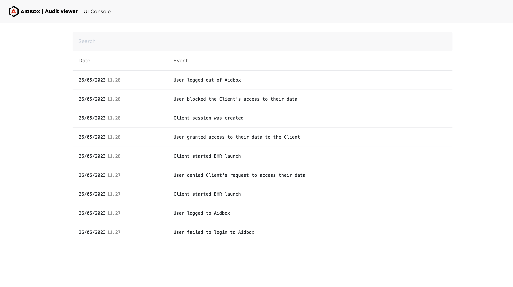
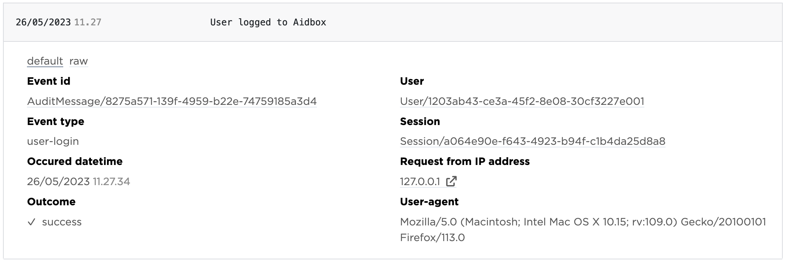

# Research possible security issues

## AuditEvent Viewer

Simplifies research, diagnose and resolve possible security breaches. It is released in May v2305 Aidbox release.

<figure><figcaption>
AuditEvent Viewer UI
</figcaption></figure>

## How to active the Viewer


Aidbox produces AuditEvents resources when the features is active


To enable the Viewer define ENV variable `box_features_audit_enable__audit__messages` and restart Aidbox.

For example, `box_features_audit_enable__audit__messages=enabled`.

## How to get into the Viewer

To open the AuditEvent Viewer click the `Audit Events` menu item in the left sidebar of the Aidbox UI.

## W-questions

AuditEvent resources and their views are defined the way to answer the w-questions:

* what happened: event type, description and additional event details
* when: occurred date and time
* where: request origins and user-agent details
* who: user, client and sessions

## Audit event details

To see a certain AuditEvent details click it. Also there is a `raw` switcher. It allows see all the AuditEvent content in raw mode.

To filter AuditEvent resources enter query string into the search bar.

<figure><figcaption>
Unfolded AuditEvent
</figcaption></figure>
