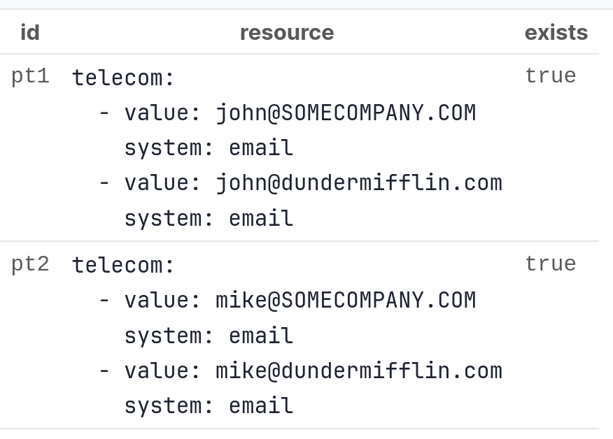

# Monitoring

## Task UI

Aidbox provides Task UI where you can search tasks and track their statuses for more efficient work with tasks.&#x20;

<figure><figcaption>
Task list
</figcaption></figure>

Task detailed view allows you to check the results, params, log of task instance transitions through statuses, and cancel tasks manually.

<figure><figcaption>
Task detailed view
</figcaption></figure>
