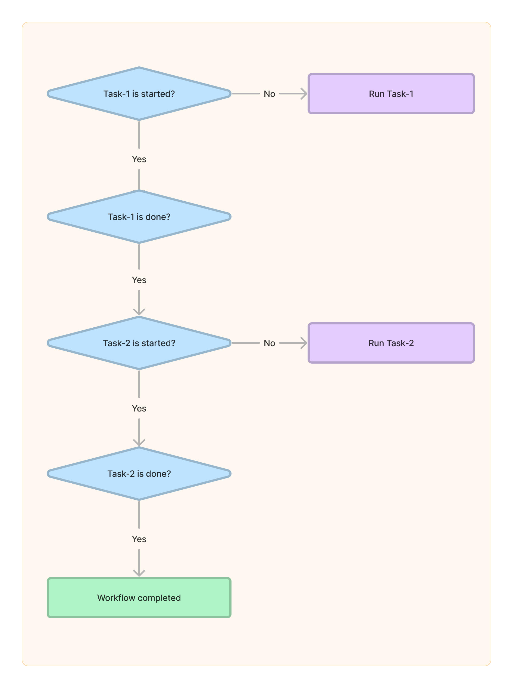
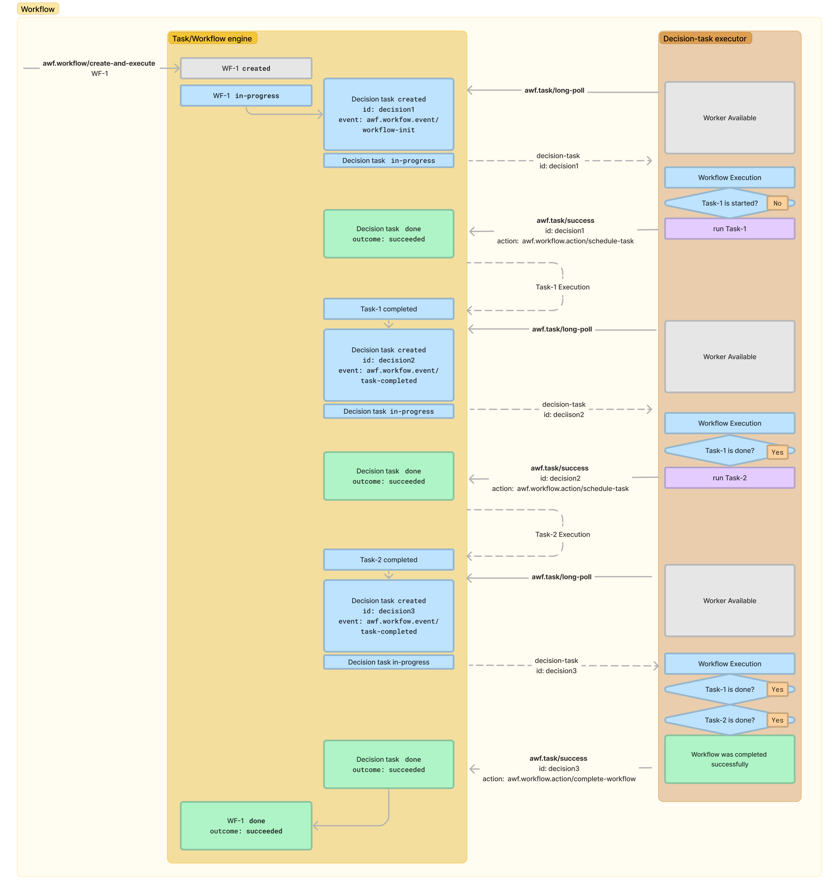

# Workflow

## Introduction

Workflow allows orchestrating a series of [tasks](../task/). Workflow in Aidbox is implemented through a special [decision](../task/aidbox-predefined-tasks.md#awf.workflow-decision-task) task, an instance of which is created on every event of workflow, thus a logic behind workflow could be implemented as an executor for this task.

We plan to add SDK for different programming languages to allow the implementation of workflow as a code on the client side. Also, we plan to introduce DSL to describe simple workflow inside Aidbox Configuration Project.&#x20;

&#x20;

## Workflow instance

When a new workflow is created  by [task-user-api.md](task-user-api.md "mention") or by [services.md](../services.md "mention"), new resource `AidboxWorkflow` is created which stores workflow Params, Result, and Status, as well as some additional information regarding workflow execution. Bellow is an example of AidboxWorkflow with fields explanation:

```clojure
{
 ;; resource or service who requested workflow execution
 :requester       {:resourceType "User" :id "admin"}

 ;; number of finished attempts to execute workflow
 :retryCount      1

 ;; UUID which is assigned to a workflow, whenever workflow is started
 ;; Executors should include it in the requests
 :execId         "44bc2-aac6-49a1-91e7-7f9fa29afe21"

 ;; Current status of the workflow.
 ;; Possible values are: "created" "in-progress" "done"
 :status          "done"

 ;; Outcome of the workflow execution, only available when workflow status is "done"
 ;; Possible values are: "succeeded" "failed"
 :outcome         "succeeded"

 ;; Only filled when outcome is "failed"
 :outcomeReason   {;; Type of "fail"
                   ;; Possible values are:
                   ;; "awf.workflow/failed-by-executor" - executor called action awf.workflow/fail, error is validated with definition schema
                   ;; "awf.executor/unknown-error" - unexpected error happened
                   :type "awf.workflow/failed-by-executor"
                   :message "Failed by executor"
                   :data {}}

 ;; Params of the workflow, as specified by caller, should be valid to the schema of the definition
 :params          {}

 ;; Result of the workflow, should be valid to the schema of the definition, only present for a task with :outcome "succeeded"
 :result          {}

 ;; Error of the workflow, should be valid to the schema of the definition, only present for a task with :outcome "failed"
 :error           {}

 ;; Id of the workflow, generated if not supplied. Should be unique across the system.
 :id  "ea82769d-e083-461c-8cb0-3427ed466f19"

 ;; Symbol of the workflow definition in Aidbox Project,
 ;; works as the unique name of the workflow that resonates with its function
 :definition  "aidbox.bulk/import-resources-workflow"

 ;; Time when workflow starts. Could be specified by the caller, or set by the engine on task retry.
 :executeAt "2023-04-24T09:30:51.562261Z"
 }
```

###

### Workflow statuses and outcomes

Below is a representation of a Workflow Instance life cycle.

<figure><figcaption><p>Workflow instance lifecycle</p></figcaption></figure>

After the workflow is created, the decision task with the same definition is created to move the workflow to the `in-progress` state and to execute the workflow body until the new internal workflow activity is started. Then the decision task is completed with a successful outcome.&#x20;

When the started activity is executed, the new decision task should execute the workflow body again to start the next activities. This process is repeated until the last activity is finished or some activity is finished with an error. After that, the workflow will change to the status `done` with one of the possible outcomes.

##

## Workflow User API

[Workflow User API](task-user-api.md) allows users to manually control Aidbox workflows by [RPC methods](../../../api-1/rpc-api.md).&#x20;

<details>

<summary>API methods</summary>

* [`awf.workflow/create-and-execute`](task-user-api.md#awf.workflow-create-and-execute) - Creates an instance of a defined workflow and makes it ready to be executed immediately or at a specified time.
* [`awf.workflow/status`](task-user-api.md#awf.workflow-status) - Returns the status of a workflow instance with the specified id.
* [`awf.workflow/list`](task-user-api.md#awf.workflow-list) - Returns the list of all workflows.

</details>


## Workflow Implementation

To add a custom workflow:

1. Add the definition of the workflow to Aidbox Project, so Task Service knows about the new task.
2. &#x20;Implement decision tasks logic using [Executor API](../task/task-executor-api.md) either directly or through the [SDK](../../../app-development/aidbox-sdk/aidbox-javascript-sdk.md#task-api).

### 1. Specify Workflow Definition

The first step for implementing a new custom workflow is to specify its definition in [aidbox-zen-lang-project](../../../aidbox-configuration/aidbox-zen-lang-project/ "mention") .&#x20;

Workflow Definition contains all the information necessary to define the behavior of a workflow instance.

Below is an example of the Aidbox Project namespace with a new workflow definition.

```clojure
{ns     my-workflows
 ;; For workflow definitions, "awf.workflow" namespace should be imported
 import #{awf.workflow}

 ;; The name of the workflow, which is referred to with the namespace as "my-workflows/example-workflow"
 example-workflow
 {
  ;; The following tags must be set for workflow definitions
  :zen/tags #{awf.workflow/definition zen/schema}

  ;; Every workflow definition is supposed to have a hash-map (dictionary-like) data structure
  :type zen/map

  ;; Define the schema of input, output, and error for workfow execution
  :keys {
         ;; Input parameters
         :params {
                  ;; Should be defined in the form of hash-map (dictionary)
                  :type zen/map

                  ;; Set the keys specified below as the mandatory fields if needed
                  :require #{:arg-required}

                  ;; Specify the names of keys with their types
                  :keys {:arg-required {:type zen/integer}
                         :arg-optional {:type zen/integer}}
                  }

         ;; The return value in case of errors
         :error {
                 ;; Should be defined in the form of hash-map (dictionary)
                 :type zen/map

                 ;; Set the keys specified below as the mandatory fields if needed
                 :require #{:my-message}

                 ;; Specify the names of keys with their types
                 :keys {:my-message {:type zen/string}}}

         ;; The return value when no errors
         :result {
                  ;; Should be defined in the form of hash-map (dictionary)
                  :type zen/map

                  ;; Set the keys specified below as the mandatory fields if needed
                  :require #{:my-result}

                  ;; Specify the names of keys with their types
                  :keys {:my-result {:type zen/number}}}}}}

```

### 2. Implement Workflow


We are now preparing Aidbox Workflow/Task SDK. By using it, you can probably simplify this step if you use one of the following languages: **Typescript**, **Python**, or **.NET**.


Once you have the workflow definition above, your custom workflow can be implemented in any programming language by using [Task Executor API](../task/task-executor-api.md) and a decision task.

The decision task is a predefined task to implement workflow and once a workflow is started, this task is executed each time when a task started by workflow is completed.&#x20;

Suppose that we are implementing a simple workflow, in which we want to start Task-1 first, and only after its successful completion start Task-2. Successful completion of Task-2 means that this workflow was completed successfully. Thus, we need a decision task as the following flowchart indicates.

<figure><figcaption><p>Flowchart</p></figcaption></figure>


Given that the decision tasks are executed repeatedly, we need to determine which action it should take each time, using conditional branching.&#x20;

This decision task will be created the first time immediately after the workflow is started, and then each time either task-1 or task-2 is completed.  Accordingly, we need to implement the entire workflow according to the following diagram. All Task-1, Task-2, and the decision task are supposed to be implemented as we explained in [#task-implementation](../task/#task-implementation "mention").

<figure><figcaption></figcaption></figure>


Here, to run **Task-1**, the decision task returns  _`action:`_**`awf.workflow.action/schedule-task`**  with the definition for Task-1, the unique label within this workflow, and the parameters for Task-1.&#x20;

When Task-1 is completed, the new decision task will be created, but this time it should run **Task-2** with the same process described above. When the value of  _`event`_ parameter for a decision task is `awf.workflow/task-completed`, the id of the completed task is placed in the _`task-id`_ parameter, so you can check it. For more details, see [#awf.workflow-decision-task](../task/aidbox-predefined-tasks.md#awf.workflow-decision-task "mention").

The last decision task must return the result of the workflow with the **`awf.workflow.action/complete-workflow`** action, and it changes the workflow status to `done`.

This was the simplest example of workflow, but you can implement various workflows checking the event parameter and setting the actions as the result of [#awf.workflow-decision-task](../task/aidbox-predefined-tasks.md#awf.workflow-decision-task "mention").
