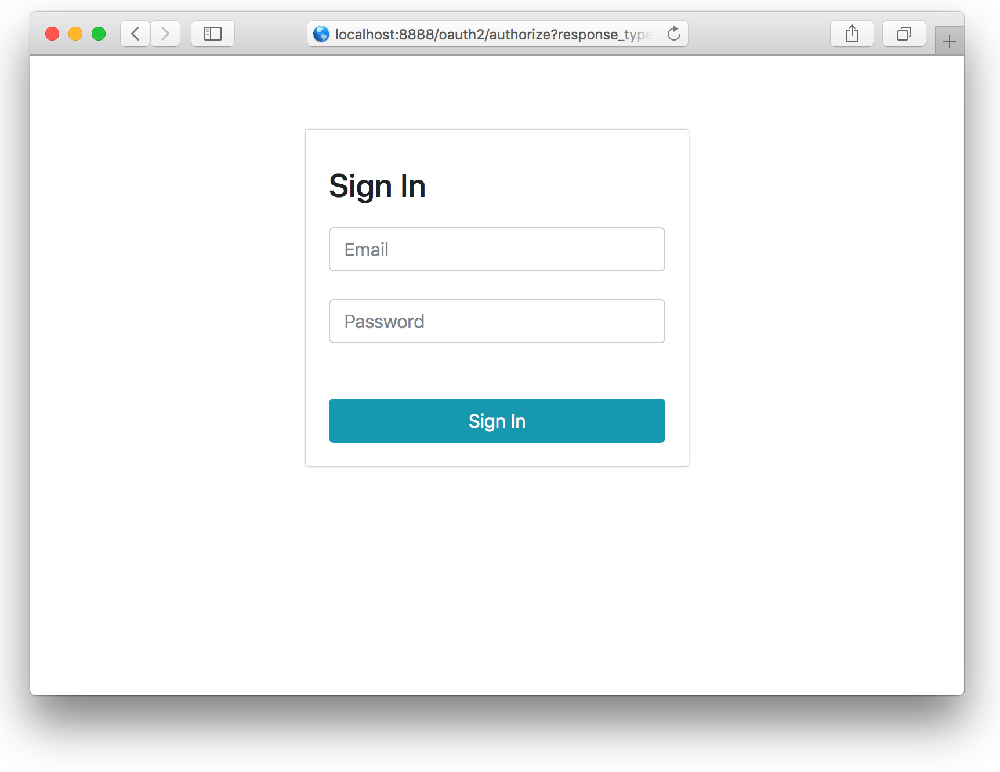

# Implicit Grant

The Implicit Grant ****is an OAuth 2.0 flow that client-side apps use in order to access an API, typically as Web SPA applications. For more detailed information read [OAuth2.0 specifcation](https://tools.ietf.org/html/rfc6749#section-4.2).

## Authorization Request

The client initiates the flow by directing the resource owner's user-agent to the authorization endpoint. The client includes its client identifier, requested scope, local state, and a redirection URI to which the authorization server will send the user-agent back once access is granted \(or denied\).



Authorization Endpoint



Initiate implicit flow






An opaque value used by the client to maintain state between the request and callback.



The scope of the request. If you want use OpenID Connect, value must contain `openid`. 



Value MUST be set to `token`. If you want use OpenID Connect and get `id_token` , value must be set to `id_token token`



Id of Client



Client redirect\_uri, if not presentet, authorization server will redirect to the first redirect\_uri described in client







Html page with ResourceOwner authorization form


```


```





### Example

Example of authorization URL for client `web-app`, and use OpenID.

```bash
GET [base]/oauth2/authorize?
    response_type=token id_token
    &client_id=web-app
    &redirect_uri=http://localhost:4200
```

Should return authentication page



## Response

After entering Resource Owner credentials, Authorization server will redirect user-agent to the redirect url with access\_token in url Fragment identifier.

#### Response Fragment parameters

| Parameter | Desription |
| :--- | :--- |
| access\_token | Access token |
| state | Initial state what send in authorization request |
| token\_type | Type of the access token. Always `bearer` |
| id\_token | Returned if specify `id_token` in `response_type`  on authorization request . [JWT](https://jwt.io/) with id token by [OpenID Connect](https://openid.net/specs/openid-connect-core-1_0.html) |

#### **Example:**

```text
http://localhost:4200/#access_token=42869629-96d5-44e5-998a-92a0da0bbbb7
                       &token_type=bearer
                       &id_token=eyJhbGciOiJSUzI...1N.df.....1fg.df...sdf
```

