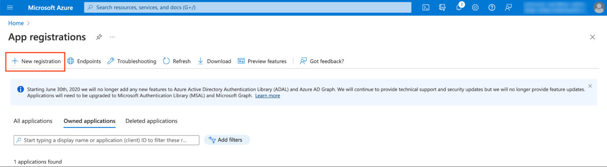
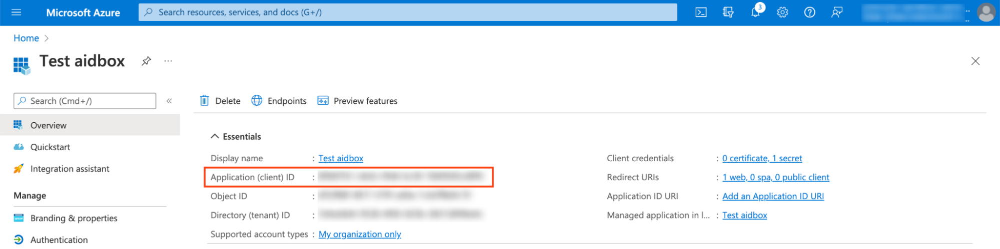

# 🎓 Azure AD

## Register an application in Azure

* Find **App Registration** in search bar


* Click **New Registration**

<figure><figcaption></figcaption></figure>

* Fill form. For Redirect URI choose `web` as a platform and input `https://<box-url>/auth/callback/azure`


* Click **Certificates & secrets > New client secret** and create a new secret. Save `Value` for next step

<figure><figcaption></figcaption></figure>

## Create IdentityProvider in Aidbox

* Open REST console in Aidbox UI and create `IdentityProvider`

```yaml
POST /IdentityProvider
content-type: text/yaml
accept: text/yaml

scopes:
  - profile
  - openid
system: azure
userinfo_endpoint: <your userinfo endpoint>
authorize_endpoint: <your authorization endpoint>
token_endpoint: <your token endpoint>
client:
  id: <your application (client) id>
  secret: <your secret value from previous step>
resourceType: IdentityProvider
title: Azure AD
active: true
id: azure
```

You can find application (client) id on **App Overview** page

<figure><figcaption></figcaption></figure>

and your endpoints by clicking on **Endpoints** and visiting `OpenID Connect metadata document`

<figure><figcaption></figcaption></figure>

## Log in to Aidbox

Go to your Aidbox base URL. You will be redirected to the log in page where you should now see `Sign in with Azure AD` button. Press this button and log in with Azure AD user. This user will be logged in to Aidbox Console but he won’t have any permissions. Read more in [Access Control Section](../../security/) about permissions.
