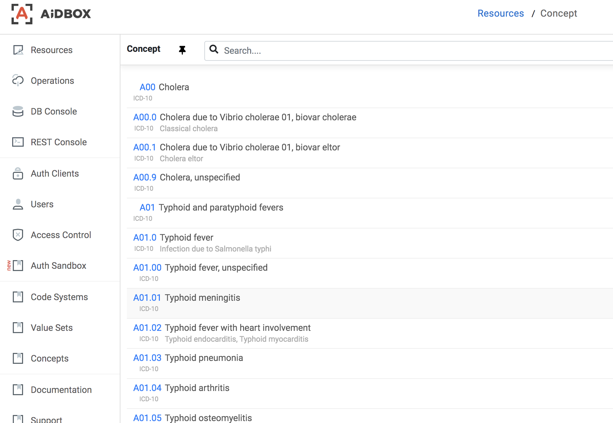

# Load Terminologies

### Load terminology packs

Aidbox provide  `terminology/$import` operation to load terminology packages prepared by Aidbox team.

For example to load ICD-10 \(Classification of Deceases\) codes you can:

```yaml
POST /terminology/$import

url: 'https://storage.googleapis.com/aidbox-public/icd10/icd10cm.ndjson.gz'

# response 200

result: {CodeSystem: 1, ValueSet: 1, Concept: 44487}
```

You see one CodeSystem and ValueSet were loaded and about 40K concepts.

Let's go to REST console and see what do we have:

```yaml
GET /Concept

# response

resourceType: Bundle
type: searchset
entry:
- resource:
    url: ICD-10
    id: icd-10
    name: ICD-10-CM
    status: active
    content: complete
    version: '2019'
    date: '2019'
    resourceType: CodeSystem
    description: International Classification of Diseases
```

```yaml
resourceType: Bundle
type: searchset
entry:
- resource:
    url: icd-10
    id: icd-10
    name: ICD-10
    status: active
    compose:
      include:
      - {system: ICD-10}
    version: 0.0.1
    date: '2019-01-01'
    resourceType: ValueSet
    description: This value set includes all ICD-10 codes.
```

Now we can search diagnoses with:

```yaml
GET /Concept?system=ICD-10&_ilike=flue

# response 200
resourceType: Bundle
type: searchset
entry:
- resource:
    code: A08
    system: ICD-10
    display: Viral and other specified intestinal infections
    property:
      icd10:
        excludes1: ['influenza with involvement of gastrointestinal tract (J09.X3, 10.2, J11.2)']
    valueset: [icd-10]
    id: ICD-10-A08
    resourceType: Concept
- resource:
    code: A41.3
    system: ICD-10
    display: Sepsis due to Hemophilus influenzae
    valueset: [icd-10]
    id: ICD-10-A41-3
    resourceType: Concept
...
```

Or  inspect concepts in Aidbox Console - go to Concepts button:



### Clean up

To clean up all terminology you can truncate all related tables from db console:

```sql
truncate concept;
truncate codesystem;
truncate valueset;
```

