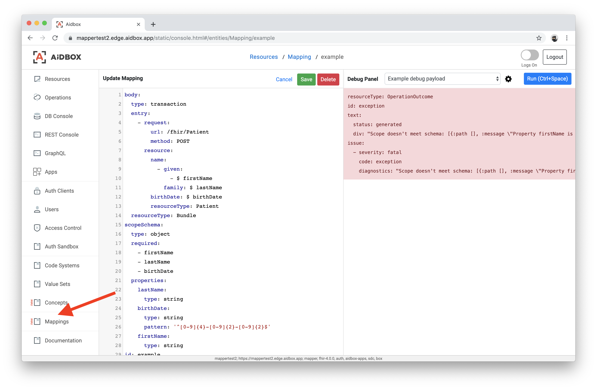

# Mappings

Most of real-world healthcare applications are integrated with 3rd-party systems to ingest data from them. Using the Mapping resource, you can describe how 3rd-party data is being converted to the FHIR format. Mappings are written using the [JUTE language](https://github.com/HealthSamurai/jute.clj#introduction).

The Mapping is an Aidbox resource, so all [CRUD operations](../api-1/api/crud-1/) are applicable to it. The Mapping's schema is pretty straightforward:

```yaml
resourceType: Mapping
id: mapping-id-here
body:
  # Executable part of the mapping written in the JUTE language (required)
scopeSchema:
  # A JSON schema for the incoming data (optional)
```

If the `scopeSchema` attribute is provided, incoming mapping data (also called a scope) will be validated against it first. Then, a JUTE template from the `body` will be executed. Mapping should return a valid [Transaction Bundle](../api-1/transaction.md), so when applied, it will be able to operate with multiple resources not just single one.

### Example

Let's do a simple mapping which will create a Patient resource from the following data structure:

```yaml
firstName: John
lastName: Smith
birthDate: 2000-01-02
```

The following request will create a mapping resource:


If you're not familiar with JUTE, please check out [JUTE Tutorial](https://github.com/HealthSamurai/jute.clj#quickstart-tutorial) to understand basic concepts.


```http
PUT /Mapping/example
Content-Type: text/yaml

resourceType: Mapping
id: example
scopeSchema:
  # JSON schema describing incoming data structure
  type: object
  required: ["firstName", "lastName", "birthDate"]
  properties:
    firstName:
      type: string 
    lastName:
      type: string
    birthDate:
      type: string
      pattern: "^[0-9]{4}-[0-9]{2}-[0-9]{2}$"

body:
  # JUTE template which transforms incoming data to Transaction Bundle
  resourceType: Bundle
  type: transaction
  entry:
    - request:
        url: /fhir/Patient
        method: POST
      resource:
        resourceType: Patient
        birthDate: $ birthDate
        name:
          - given: ["$ firstName"]
            family: $ lastName

```

When a template is created, you can invoke the $apply operation on it to generate a Patient resource and save it into the database:

```yaml
POST /Mapping/example/$apply
Content-Type: text/yaml

firstName: John
lastName: Smith
birthDate: '2010-12-12'
```

### $apply Endpoint

To execute Mapping and store its result to the Aidbox database, do a POST request to the $apply endpoint. Request's body will be passed to a JUTE as an incoming data (scope):

```http
POST /Mapping/<mapping-id>/$apply
Content-Type: application/json

{ "foo": 42, "bar": "hello" }
```


Make sure that your Mapping returns a Transaction Bundle, otherwise its result won't be persisted to a database.


### $debug Endpoint

To check Mapping's result without actual persisting, you can do a POST request to the $debug endpoint:

```http
POST /Mapping/<mapping-id>/$debug
Content-Type: text/yaml

foo: 42
bar: hello
```

Response will contain a mapping result or an error if evaluation failed for some reason.

### Global $debug Endpoint

There is a way to check a mapping result without persisting it as a resource:

```http
POST /Mapping/$debug
Content-Type: text/yaml

mapping:
  body:
    mul: $ 2 * foo
    str: $ "hello, " + name
    
  scopeSchema:
    type: object
    required: ["foo", "name"]
    properties:
      foo:
        type: integer
      name:
        type: string
    
scope:
  foo: 4
  name: "Bob"
```

You pass both Mapping and incoming data (scope) in a request body. Request response will contain the mapping result or an error information.

### Including Mapping inside other Mapping

In Aidbox, there is the `$include` directive which allows you to include a Mapping within another one:

```
PUT /Mapping/index
Content-Type: text/yaml

resourceType: Mapping
id: index
body:
  $switch: $ type
  patient:
    $include: "patient"
  practitioner:
    $include: "practitioner"
  $default: null
```

This template will pass execution to either `/Mapping/patient` or `/Mapping/practitioner` depending on the value of the `type` key. Current evaluation scope will be passed to the included Mapping.


Because potentially there is a way to create an infinite recursion using the`$include` directive, there is an inclusion depth limit which equals to **5** for now.


### Mapping Parameters

**`omit-drop-blanks` parameter**

Let's say we want to specify request depending on the gender field:

```yaml
PATCH /Mapping/pat-example

body:
  entry:
    - request:
        url: $ '/Patient/' + patientId
        method: PATCH
      resource:
        resourceType: "Patient"
        gender:
          $if: $ gender
          $then: $ gender
          $else: null
```

JUTE will remove all empty values (nulls and empty arrays) and Aidbox will answer with "Please provide body for patch" response.

Passing `omit-drop-blanks` parameter will solve the issue.

```yaml
PATCH /Mapping/pat-example

params:
  omit-drop-blanks: true
body:
  entry:
    - request:
        url: $ '/Patient/' + patientId
        method: PATCH
      resource:
        resourceType: "Patient"
        gender:
          $if: $ gender
          $then: $ gender
          $else: null
```

### Mapping Editor in the Aidbox UI



There is a Mapping Editor in the Aidbox UI with a built-in syntax checker and Debug capabilities. Search for the "Mappings" item in the left navigation menu.
