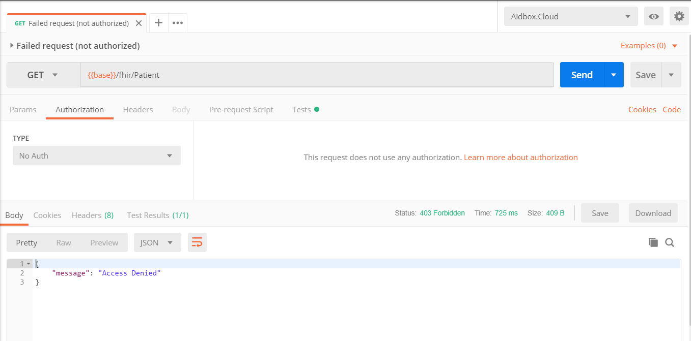
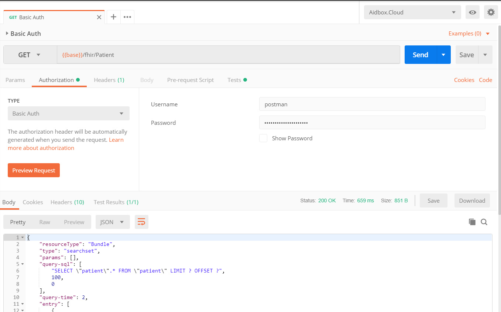
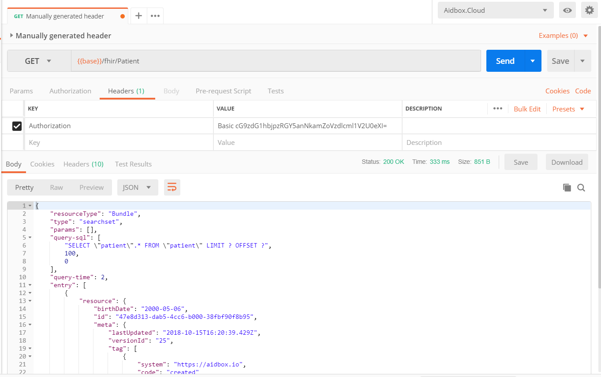

# Authentication and Authorization

There are several options for authentication but let's start from the simplest one: basic authentication. It's widely supported and easy to use.

## Basic Authentication

When an [Aidbox](https://www.health-samurai.io/aidbox) box is created \(for example, `<your-box>`\), you get a fully functional FHIR server and can make requests to it by the URL like`https://<your-box>.aidbox.app`. Make sure that you use the proper name of your new box instead of `<your-box>`.   
To give an example, let's try to obtain a patient list. 





Get 403



The attempt to obtain the patient list from a secure FHIR server.






We don't know what to put here yet.







Obviously results to failure


```
{
  "message": "Access Denied"
}
```





### Create a client

Error message and response code give us a tip that the server requires authentication. To make it possible, we need to create a subject for authentication \(a client\).

Open [https://ui.aidbox.app](https://ui.aidbox.app), choose your box, open section **Auth clients**, click the button **New** to create an auth client, and type the following body for the resource:



```yaml
resourceType: Client
id: USERNAME
secret: PASSWORD
grant_types: ['basic']
```



```javascript
{ 
  "resourceType": "Client",
  "id": "USERNAME",
  "secret": "PASSWORD",
  "grant_types": ['basic']
}
```



Place proper values instead of `USERNAME` and `PASSWORD`, click **Save**.

### Create an access policy

After that, we need to create a policy that authorizes the created client to read and edit all resources. Open the **Access Control** section, create a new access policy using the **New** button:



```yaml
resourceType: AccessPolicy
id: client1-access
engine: json-schema
schema:
  required: ['client']
  properties:
    client:
      required: ['id']
      properties:
        id: { constant: USERNAME }
```



```javascript
{
  "resourceType": "AccessPolicy",
  "id": "client1-access",
  "engine": "json-schema",
  "schema": {
    "required": [
      "client"
    ],
    "properties": {
      "client": {
        "required": [
          "id"
        ],
        "properties": {
          "id": {
            "constant": "USERNAME"
          }
        }
      }
    }
  }
}
```



Now USERNAME:PASSWORD can be used to access the box via basic authentication.

### Checking Authorization

To check authorization, we need a client. We can use [Postman](https://www.getpostman.com/) as a client. This is how it's done in Postman.


Option 1. Basic Auth


 In Postman, create a new request, switch to **Authorization** tab, select **Basic Auth**.

Enter Username and Password. It should be the same values as you entered in the resources Client and AccessPolicy in your instance of Aidbox.Cloud. Now the request will be executed successfully.




Option 2. Manually generated value in Headers/Authorization


Basic authentication scheme is described in [RFC 2617](https://tools.ietf.org/html/rfc2617#page-5) and requires an `Authorization` header value in the following format: `Basic VVNFUk5BTUU6UEFTU1dPUkQK`.

In a command console, encode your username and password to base64 encoding with the following command: 

```bash
echo -n "USERNAME:PASSWORD" | base64

# The output will be:

# VVNFUk5BTUU6UEFTU1dPUkQK
```

In Postman, create a new request, access the Headers tab,  select the Authorization key, and enter the generated value with appended word `Basic`: `Basic VVNFUk5BTUU6UEFTU1dPUkQK`. 





Get patient list



Get the bundle resource which contains a list of patients.






String which contains word \`Basic\`, space and USERNAME:PASSWORD base64 encoded string 







Patients successfully retrieved.


```javascript
{
  "resourceType": "Bundle",
  "type": "searchset",
  "params": [],
  "query-sql": [
    "SELECT \"patient\".* FROM \"patient\" LIMIT ? OFFSET ?",
    100,
    0
  ],
  "query-time": 2,
  "entry": [],
  "total": "_undefined",
  "link": []
}The endpoint https://<your-box>.aidbox.app/Patient allows you to get a list of patients but requires an authentication in most cases. Let's prepare an authorization header to help the server to authenticate our client and authorize the request to /Patient.
```





It works! You are awesome!

