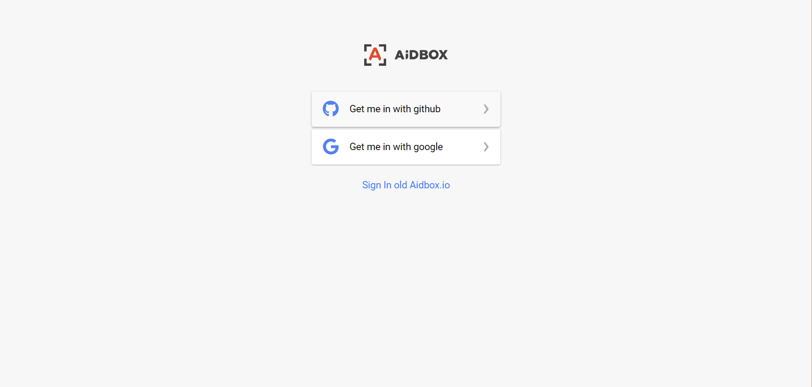
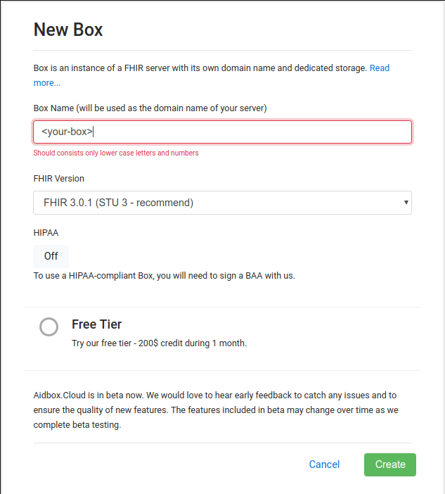
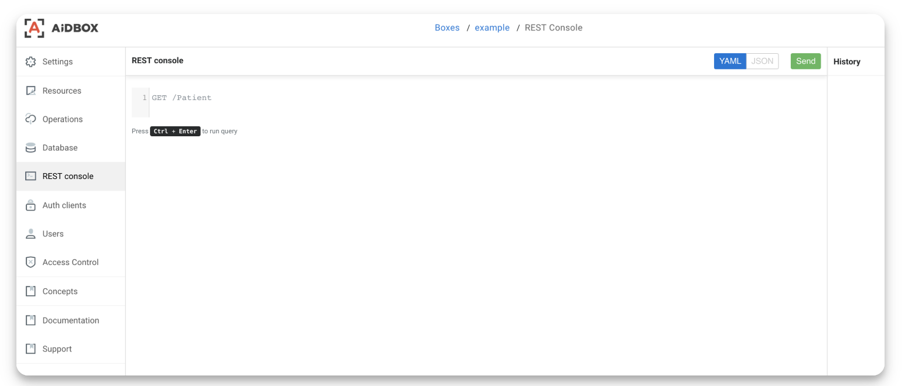
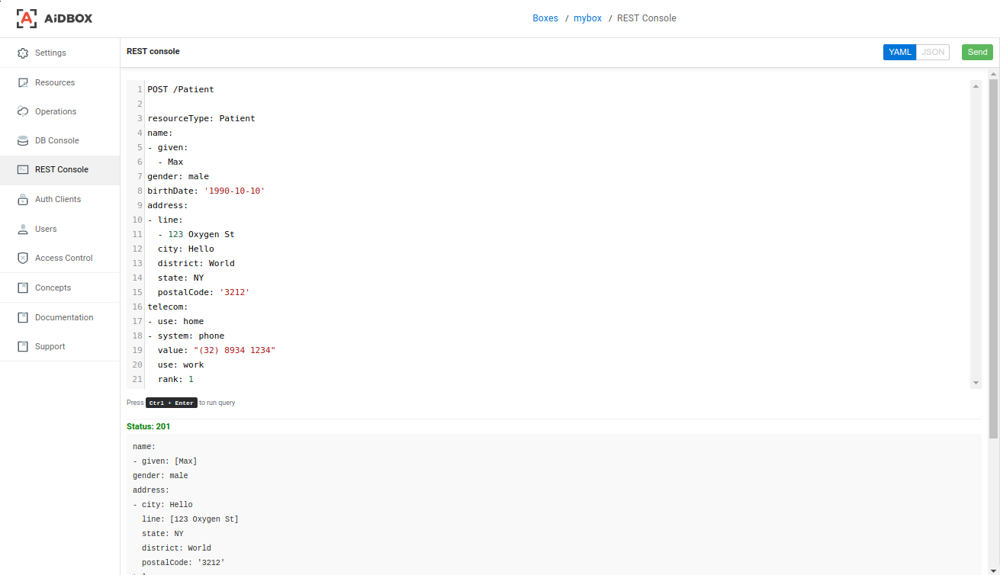
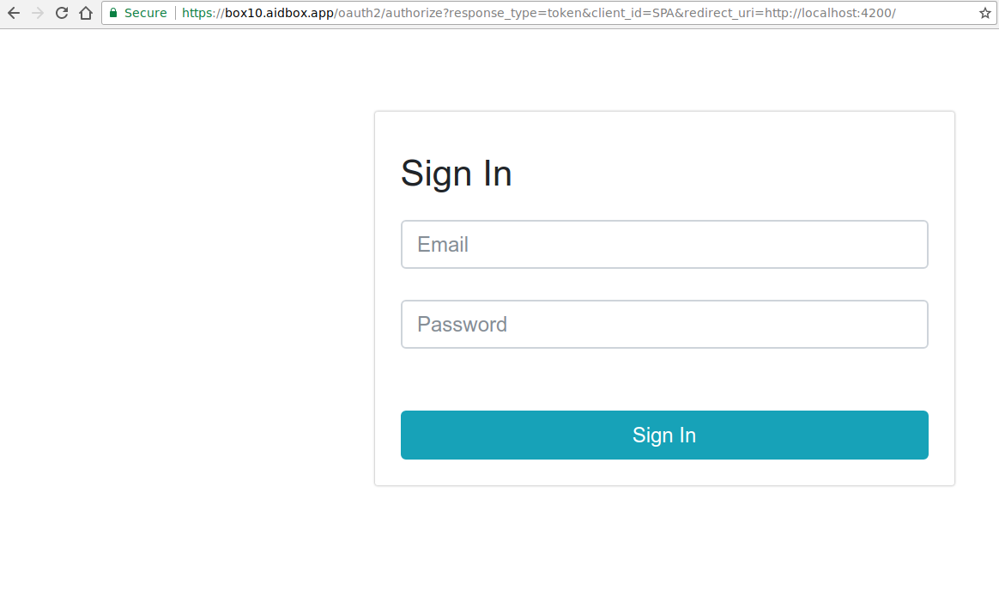
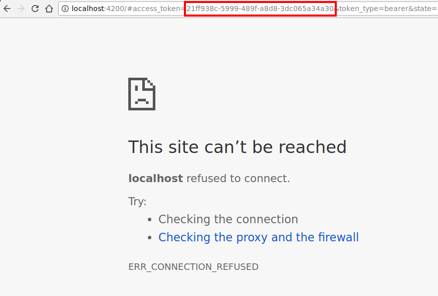
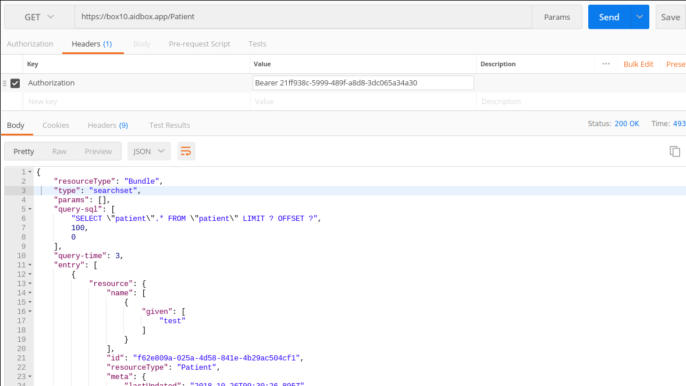
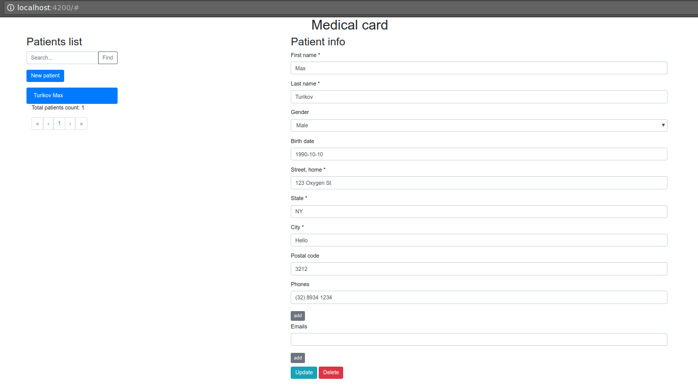

# Getting Started with SPA

After reading this guide and performing all steps, you will learn:

* What is FHIR and SPA
* How to create an instance of FHIR server
* Basics of FHIR RESTful API
* How to make secure requests to FHIR server
* How to create a new SPA and connect it to a FHIR server

## Introduction

#### Basic terms

* [FHIR](https://www.hl7.org/fhir/index.html) is a platform specification that defines a set of [entities](https://www.hl7.org/fhir/resourcelist.html) and [operations](https://www.hl7.org/fhir/http.html) on those entities for interoperability between healthcare systems and applications
* [FHIR server](https://aidbox.app) is a web application implementing FHIR specification and providing RESTful API
* [SPA](https://en.wikipedia.org/wiki/Single-page_application) is a single-page application, which runs in user web browser, in our case it will be an [Angular](https://angular.io/) based project
* Box is an instance of FHIR server provided by any Aidbox product

#### Guide assumptions

This guide assumes that you already have installed [git](https://git-scm.com/downloads), [npm](https://www.npmjs.com/get-npm), [postman](https://www.getpostman.com/apps) and have a terminal application.

In this guide we will be using Aidbox.Cloud for simplicity of Box creation, but any other Aidbox product will also work.

This guide assumes that you will set proper values instead of placeholders like this: `<YOUR-BOX>`

## Create a box

Choose how you would like to authorize [Aidbox](https://ui.aidbox.app). It can be done via your Github or Google account.



After you have been successfully authorized in [Aidbox.Cloud](https://ui.aidbox.app), click the 'New Box' button to start.


In the displayed form, enter your future box name. It can be a name of your application you are going to build, choose your plan and click 'Create' button.



Your new box was successfully created. Click the box name to proceed.


## Check the CRUD

Now go to `REST console` section and let's see what can we do here.



REST console is designed to work with resources on your `Box` by sending HTTP requests in accordance with [FHIR RESTful API](http://hl7.org/fhir/http.html). To do this, we need to type - a HTTP verb \(`GET`, `POST`, `PUT`, `PATCH`, `DELETE`\) and the address of the resource \(for example `/Patient` - _pay attention to the resource name with a capital letter_\), in cases when you need to send the request body \(e.g -  `POST` request\), it passed separated by empty line, in YAML or JSON format - you can choose both \(request and response\) content type by **YAML** \| JSON switcher.

### Create a Patient

Let's add a couple of new patients -  for this we type in our console `POST /Patient` and in the body of the request wherein we will send the data of our new patient \(Aidbox supports JSON and few other formats, but we will use YAML for [compactness and readability](../faq/why-yaml.md)\):


Use copy button in top right corner of code snippet to avoid copying of unnecessary white space characters.




```yaml
POST /Patient

resourceType: Patient
name:
- given: [Max]
  family: Turikov
gender: male
birthDate: '1990-10-10'
address:
- line:
  - 123 Oxygen St
  city: Hello
  district: World
  state: NY
  postalCode: '3212'
telecom:
- use: home
- system: phone
  value: "(32) 8934 1234"
  use: work
  rank: 1
```



```yaml
Status: 201

name:
- given: [Max]
gender: male
address:
- city: Hello
  line: [123 Oxygen St]
  state: NY
  district: World
  postalCode: '3212'
telecom:
- {use: home}
- {use: work, rank: 1, value: (32) 8934 1234, system: phone}
birthDate: '1990-10-10'
id: 957d782d-3e40-4978-968c-63a1ef7d2473
resourceType: Patient
meta:
  lastUpdated: '2018-10-29T09:09:16.604Z'
  versionId: '118'
  tag:
  - {system: 'https://aidbox.io', code: created}
```



This is example, you can change values as you want, but for more information check full [Patient resource](https://www.hl7.org/fhir/patient.html) description and [official example](https://www.hl7.org/fhir/patient-example.json.html). The `id` field in the request body is not required, if you do not send it to the server, it will be generated. A description of the difference in `create` operation behavior between FHIR and Aidbox endpoints can be found [here](../basic-concepts/aidbox-vs-fhir.md).



### Get a Patient

After sending the request - we receive a response with `Status: 201` and the sent data - our patient is created. We can make sure of this by sending request  `GET /Patient/<id>` and receive created patient data \(in our case id is `957d782d-3e40-4978-968c-63a1ef7d2473`, we got id from response\),  or we can check a complete list of patients - `GET /Patient` 



```javascript
GET /Patient/957d782d-3e40-4978-968c-63a1ef7d2473
```



```yaml
Status: 200

name:
- given: [Max]
gender: male
address:
- city: Hello
  line: [123 Oxygen St]
  state: NY
  district: World
  postalCode: '3212'
telecom:
- {use: home}
- {use: work, rank: 1, value: (32) 8934 1234, system: phone}
birthDate: '1990-10-10'
id: 957d782d-3e40-4978-968c-63a1ef7d2473
resourceType: Patient
meta:
  lastUpdated: '2018-10-29T09:09:16.604Z'
  versionId: '118'
  tag:
  - {system: 'https://aidbox.io', code: created}
```



There are much more operations that can be done with server using [RESTful API](../api/), but for our case to check if everything set up properly and to get basic understanding of FHIR RESTful API  `POST` and `GET` requests are enough.

## Give access to external clients

Aidbox products support [OAuth2.0](../security/oauth-2.0/) authorization framework and [Access Control](../security/access-control.md) mechanism to provide ability for developers to create applications, which can interact securely with Boxes \(Aidbox FHIR server instances\). For single-page application it's a common practice to use OAuth2.0 [Implicit Grant flow](../security/oauth-2.0/implicit.md).

To implement this flow we need to create 3 entities:

* **User** - the person, who will login and use application
* **Client** - our single-page application, which will interact with FHIR server
* **AccessPolicy** - set of rules, which describes, who and how can access FHIR server


Why so much moves needed to simply access FHIR resource using external client? Ask Aidbox developers and people in our community [chat](https://community.aidbox.app/) \([\#aidbox](https://community.aidbox.app/) channel\).


We will create all three entities with one request \(don't forget to **change** admin password!\):



```yaml
POST /

type: transaction
entry:
- resource:
    id: admin
    email: "admin@mail.com" # Change this value
    password: "password" # Change this value
  request:
    method: POST
    url: "/User"

- resource:
    id: SPA
    redirect_uri: http://localhost:4200
  request:
    method: POST
    url: "/Client"
    
- resource:
    engine: json-schema
    schema:
      type: object
      required:
      - user
  request:
    method: POST
    url: "/AccessPolicy"
```



```yaml
Status: 200

id: '119'
type: transaction-response
resourceType: Bundle
entry:
- resource:
    secret: null
    redirect_uri: http://localhost:4200
    id: SPA
    resourceType: Client
    meta:
      lastUpdated: '2018-10-29T09:23:59.396Z'
      versionId: '119'
      tag:
      - {system: 'https://aidbox.io', code: created}
  status: 201
- resource:
    email: admin@mail.com
    password: $s0$f0801$JH/e5UHpObbWXY/UnnDX+A==$5czycStbfIx2MF4SX7jQpkCxBKtwxPU7QkJQHizUGiE=
    id: admin
    resourceType: User
    meta:
      lastUpdated: '2018-10-29T09:23:59.396Z'
      versionId: '119'
      tag:
      - {system: 'https://aidbox.io', code: created}
  status: 201
- resource:
    engine: json-schema
    schema:
      type: object
      required: [user]
    id: 85d32690-77b6-45ba-be73-0dab60b1212a
    resourceType: AccessPolicy
    meta:
      lastUpdated: '2018-10-29T09:23:59.396Z'
      versionId: '119'
      tag:
      - {system: 'https://aidbox.io', code: created}
  status: 201
```



We created a Client resource with redirect uri equal to our SPA address, admin User with password `password` and AccessPolicy, which tells to authorize any registered user.

### Get an access token

Now we can request a token from our box using OAuth2.0 implicit grant flow.

Change `<YOUR-BOX>` to name of your box and open following url in your browser.

`https://<YOUR-BOX>.aidbox.app/oauth2/authorize?response_type=token&client_id=SPA&redirect_uri=http://localhost:4200/`



Enter email and password of the User, click 'Sign In' and you will be redirected to localhost:4200 \(redirect\_uri of SPA client\).



Copy access\_token value, we will use it to obtain Patient resource with external http client.

### Check the access

Open [Postman](https://www.getpostman.com/apps) or any other http client, create new `GET` request, enter following url: `https://<YOUR-BOX>.aidbox.app/Patient` and add `Authorization` header with value equal to `Bearer <YOUR-ACCESS-TOKEN-HERE>`.



  
You should get a bundle with Patient resources. Yay! It seems to work.

## Create FHIR SPA

On the final step we will configure and start our SPA. Make sure that you have [Git](https://git-scm.com/downloads) and [Node.js](https://nodejs.org/en/download/) installed.

```bash
git --version # checks if git and other packages installed
# git version 2.15.2                                                        │
node --version
# v8.9.4
npm --version # node package manager
# 5.6.0

git clone https://github.com/HealthSamurai/aidbox-angular-sample.git
cd aidbox-angular-sample
vim environment.ts # or use any other editor of your choice
# to set AIDBOX_URL var to https://<YOUR-BOX>.aidbox.app

npm install # install all project dependencies
npm install -g @angular/cli # install angular utilities
ng serve # start a web server for our SPA
```

Open [http://localhost:4200](http://localhost:4200), you automatically will be redirected to your box OAuth2.0 login page. Log in with email and password you set for User previously.



It works! You are awesome!


Want to know more about Aidbox, FHIR or FHIR applications? Join our community [chat](https://community.aidbox.app/) \([\#aidbox](https://community.aidbox.app/) channel\).


