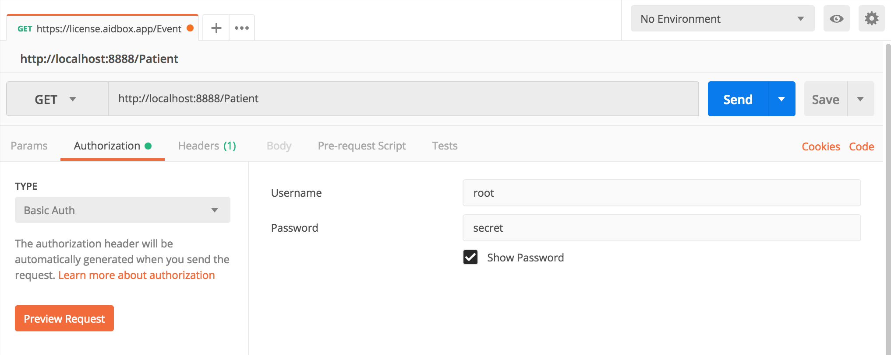
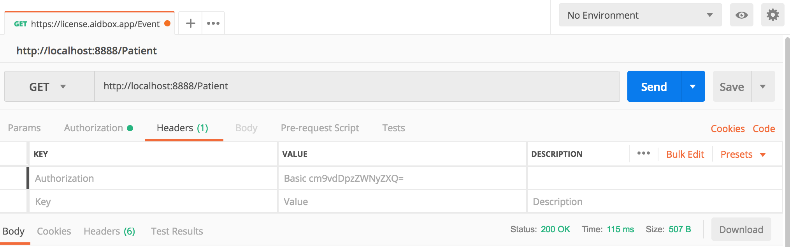

# REST API Access in Aidbox.Dev

## Aidbox.Dev Access 

By default, `Aidbox.Dev` is distributed with public access. This is made to simplify the use of `Aidbox.dev` for first time. But the other side this mean than anyone who knows an address of your service can get full access to your REST API. We are strongly not recommending to keep public access in production mode.

If you don't want to restrict an access to your Aidbox.Dev instance and wish to keep it public, you can skip this step and go to the [Patient CRUD SPA](run-local-demo.md).



### Restrict Access

If you want to enable Access Policy in your installation, you need to setup `AIDBOX_CLIENT_SECRET` environment variable in the `Aidbox.Dev` container. You can do this by uncommenting the appropriate line in the `docker-compose.yaml` file.


```yaml
version: '3.1'
services:

  devbox:
    ......
    environment:
      # AIDBOX_CLIENT_SECRET: "${AIDBOX_CLIENT_SECRET:-secret}"  # < Uncomment this string
    ......
```


After installation of `Aidbox.Dev` you get one default [`Client`]() resource. This resource is used in OAuth 2.0 functionality. Also, this resource may be used for `Basic Authorization`. In this tutorial we will use this [`Client`]() for basic authorization in Aidbox.Dev .

Default `Client` will be created with `password` described in `DEVBOX_PASSWORD` environment variable sent to the container in the `docker-compose.yaml` . If you did not explicitly specify `DEVBOX_PASSWORD` by default it was set to `secret`. We are strongly recommending to change the default password in your installation. [`Client.id`]() of this client is constantly `root`.


```yaml
version: '3.1'
services:
  devbox:
    ......
    environment:
      AIDBOX_CLIENT_SECRET: "${AIDBOX_CLIENT_SECRET:-secret}"
    ......
```


## Basic Authorization

### Authorization header

By [The 'Basic' HTTP Authentication Scheme](https://tools.ietf.org/html/rfc7617)[ ](https://tools.ietf.org/html/rfc7617)specification you need transfer `Authorization` header with request.

#### Bash

Build your authorization token by getting base64 encode from "`root`:`secret`" string.

```bash
$ echo -n "root:sercret" | base64
# cm9vdDpzZWNyZXQ=
```

Now you can request Patient list with `Authorization` header equal -   
"`Basic cm9vdDpzZWNyZXQ=`"

```bash
$ curl -H "Authorization: Basic cm9vdDpzZWNyZXQ=" http://localhost:8888/Patient
```

Another way is directly specify username and password in [`curl`](https://curl.haxx.se)

```bash
$ curl -u root:secret http://localhost:8888/Patient
```

#### Postman

Open `Authorization` tab and select `Basic Auth` in authorization `TYPE` dropdown. After that type you Client.id in to `Username` input, and Client password in to `Password` input. In our case it wold be `root` and `secret`.



Postman automatically added `Authorization` header with token.



### Create and read Patient resource

Now you have full REST Api access to the Aidbox.Dev. For example let's play with `Patient` resource. 

**Create test Patient**



```bash
$ curl -X POST  http://localhost:8888/Patient \
  -u root:secret \
  -H 'Content-Type: application/json' \
  -d '{"name": [{"given": ["Test"], "family": "Patient"}]}'
```



```javascript
STATUS: 201
{
    "resourceType": "Patient",
    "name": [
        {
            "given": [
                "Test"
            ],
            "family": "Patient"
        }
    ]
    ...    
    }
}
```



**Read Patients list**



```bash
$ curl  -u root:secret http://localhost:8888/Patient
```



```javascript
{
    "resourceType": "Bundle",
    "type": "searchset",
    "entry": [
      {"resource" : {
         "resourceType": "Patient",
         "name": [
         {
            "given": [
                "Test"
            ],
            "family": "Patient"
        }
       ]
       ....
      }}
    ]
}
```



## What next?

Learn how to start up with simple Single Page Application with Patient list and Patient CRUD in our tutorial.




