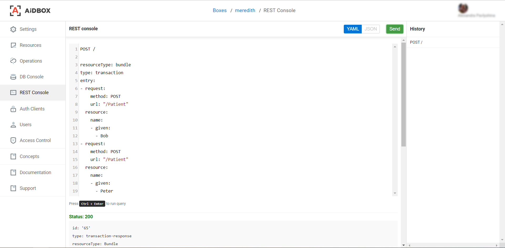
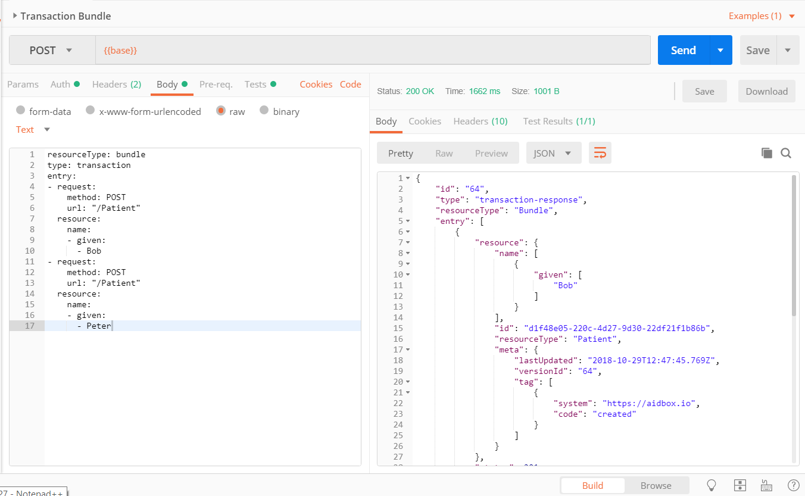

# Uploading Bundles

## Endpoint for Bundles

Aidbox endpoint for bundles will be the base URL of your Box: `/` in Aidbox REST Console and `{{base}}` in Postman collections. 

## Bundle Example

According to the [FHIR specification](https://www.hl7.org/fhir/http.html#transaction), bundle is a container for a collection of resources for transport and persistence purposes. Below is an example of how to create two patients using one transaction request.



```yaml
POST /

resourceType: bundle
type: transaction
entry:
- request:
    method: POST
    url: "/Patient"
  resource:
    name:
    - given:
      - Bob
- request:
    method: POST
    url: "/Patient"
  resource:
    name:
    - given:
      - Peter
```



```javascript
POST /

{
  "resourceType": "bundle",
  "type": "transaction",
  "entry":
  [{
      "request": {
        "method": "POST",
        "url": "/Patient"
      },
      "resource": {
        "name": [{
            "given": ["Bob"]
          }
        ]
      }
    }, {
      "request": {
        "method": "POST",
        "url": "/Patient"
      },
      "resource": {
        "name": [{
            "given": ["Peter"]
          }
        ]
      }
    }
  ]
}
```



```javascript
{
    "id": "64",
    "type": "transaction-response",
    "resourceType": "Bundle",
    "entry": [
        {
            "resource": {
                "name": [
                    {
                        "given": [
                            "Bob"
                        ]
                    }
                ],
                "id": "d1f48e05-220c-4d27-9d30-22df21f1b86b",
                "resourceType": "Patient",
                "meta": {
                    "lastUpdated": "2018-10-29T12:47:45.769Z",
                    "versionId": "64",
                    "tag": [
                        {
                            "system": "https://aidbox.io",
                            "code": "created"
                        }
                    ]
                }
            },
            "status": 201
        },
        {
            "resource": {
                "name": [
                    {
                        "given": [
                            "Peter"
                        ]
                    }
                ],
                "id": "49bcfa88-9915-4832-a763-1d60cb561cc3",
                "resourceType": "Patient",
                "meta": {
                    "lastUpdated": "2018-10-29T12:47:45.769Z",
                    "versionId": "64",
                    "tag": [
                        {
                            "system": "https://aidbox.io",
                            "code": "created"
                        }
                    ]
                }
            },
            "status": 201
        }
    ]
}
```



According to the [FHIR specification](https://www.hl7.org/fhir/http.html#transaction), bundle is a container for a collection of resources for transport and persistence purposes, and a bundle should look like:

```javascript
{
  "resourceType": "bundle",
  "type": "transaction",
  "entry": [{
      "request": {
        "method": "GET",
        "url": "/Patient"
      }
    }
  ]
}

```

Every transaction bundle MUST have the **type** field which value can be **transaction** or **batch**, each `entry` MUST have **method** and **url** fields in the `request` element.

Bundles must be sent via POST method to BASE\_URL which is basically the URL of your Box.

## Transaction Operation

It is possible to upload data to Aidbox using the transaction operation. The example below demonstrates how to create two patients using one transaction request.

```javascript
POST /

{
  "resourceType": "bundle",
  "type": "transaction",
  "entry":
  [{
      "request": {
        "method": "POST",
        "url": "/Patient"
      },
      "resource": {
        "name": [{
            "given": ["Bob"]
          }
        ]
      }
    }, {
      "request": {
        "method": "POST",
        "url": "/Patient"
      },
      "resource": {
        "name": [{
            "given": ["Peter"]
          }
        ]
      }
    }
  ]
}
```

It can be done with Postman or Aidbox.Cloud user interface.

### Aidbox REST Console

1. Access your Box in Aidbox.Cloud.
2. Open REST Console.
3. Type in `POST /`.
4. Leave next line empty.
5. Paste your bundle.
6. Press Ctrl+Enter or click the **Send** button.



### Postman

1. Create new request.
2. Select the POST action.
3. Type in base URL of your Box \(we're using `base` variable in the example on the screenshot below\).
4. On the Body tab, select raw option and paste your bundle in YAML or JSON format.
5. For YAML format, add the `Content-Type` `application/yaml` header in Headers tab.
6. For JSON, select `JSON` in the drop down.
7. On the Auth tab, select Basic Auth value and enter Username and Password \(see [Authentication and Authorization](authentication-and-authorization.md)\).
8. Now, click the **Send** button to execute the request.



This is a brief description about how to work with transactions and batches in Aidbox. More interesting information coming soon, stay tuned!

## Generating transaction bundle with Synthea \(advanced topic\)

Here's how we can install Synthea — [Synthetic Patient Population Simulator](https://github.com/synthetichealth/synthea).

```bash
git clone https://github.com/synthetichealth/synthea.git
cd synthea
./gradlew build check test
```

Edit the `src/main/resources/synthea.properties`  file to get output in the transaction bundle format:

```groovy
exporter.fhir.transaction_bundle = true
```

Generating the population one at a time...

```bash
./run_synthea -s 1000
ls output/fhir
```

...you should see two files with names similar to those:

```bash
hospitalInformation1537450368636.json 
Mckinley734_Johnston597_f25b9177-3c01-4d76-a48f-0a83affa5a56.json
```

Copy content of first file to Postman, use `BASE_URL/fhir` \(`https://<your-box>.aidbox.app/fhir` for example\) as url to upload FHIR transaction bundle. Everything else is the same as in the previous step. After that, upload the content of the second file into Aidbox. That's all, you are awesome!

Read more about Synthea generator - [https://github.com/synthetichealth/synthea](https://github.com/synthetichealth/synthea).

