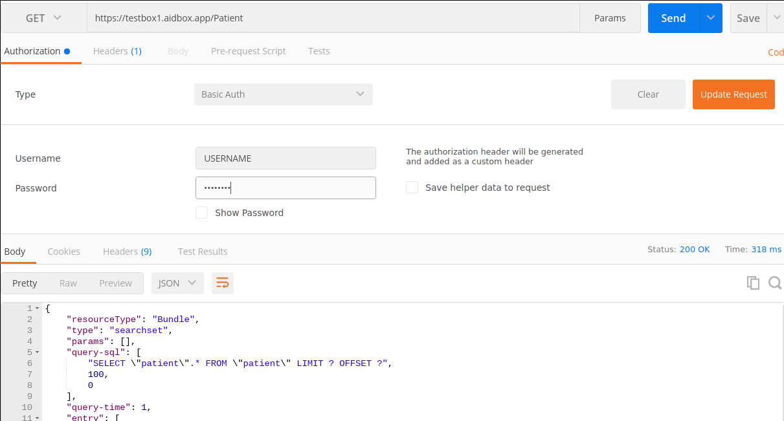
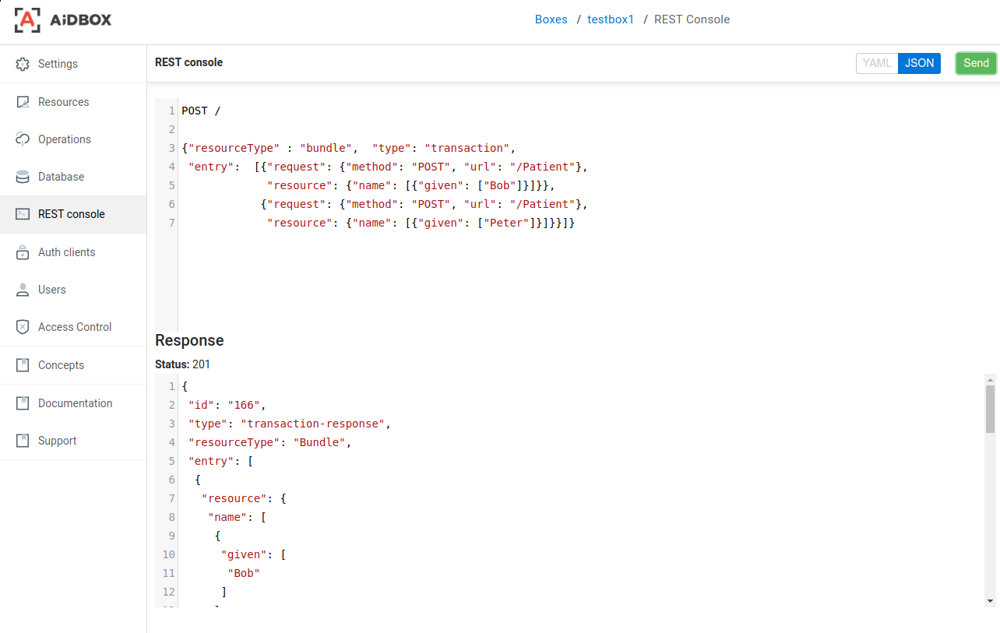

# Load bundle into aidbox.app

### Create your box

Register on https://aidbox.app using your github or google account.

Read how to register and create box in this [tutorial](create-and-configure-box.md).

### Setup Access Policy

Let's configure simple policy to access API using basic auth \(login/password\):

Open section **Auth clients**, click button **new** to create auth client and type following body for resource:

```text
resourceType: Client
id: USERNAME
secret: PASSWORD
```

 Using transaction Operation

Click `save`, open **Access Control** section, create new access policy using **new** button:  


```text
engine: json-schema
schema:
  required:
    - client
  properties:
    client:
      required:
        - id
      properties:
        id:
          constant: USERNAME
id: client1-access
resourceType: AccessPolicy
```

Now USERNAME/PASSWORD can be used to access the box via basic auth.

### Access data by REST API

Let's check that everything working fine. Create new `GET` request, fill all required fields \(url, username, password\) in postman or other http client and run the query. Result should look like that picture:



### Bundle example

According to [fhir specification](https://www.hl7.org/fhir/http.html#transaction) bundle resource should look like:

```text
{"resourceType" : "bundle",
 "type": "transaction",
 "entry": [{"request": {"method": "GET", "url": "/Patient"}}]}
```

Every transaction bundle MUST have **type** field, which value can be **transaction** or **batch**, every entry inside MUST have **method** and **url** fields inside request map.

The bundle must be sentvia POST method to BASE\_URL, which is basically the url of your box from previous section

### Load data into aidbox using transaction Operation

The example below demonstrates how to create two patients using one transaction request.

```text
{"resourceType" : "bundle", 
 "type": "transaction", 
 "entry": 
 [{"request": {"method": "POST", "url": "/Patient"},
   "resource": {"name": [{"given": ["Bob"]}]}},
   {"request": {"method": "POST", "url": "/Patient"},
   "resource": {"name": [{"given": ["Peter"]}]}}]}
```

It can be done with postman or aidbox ui:




This is a brief description about how to work with transactions and batches in aidbox. More interesting info coming soon, stay tuned!

### Generating transaction bundle with synthea \(advanced topic\)

Here how we can install synthea.

```text
git clone https://github.com/synthetichealth/synthea.git
cd synthea
./gradlew build check test
```

Edit `src\main\resources\synthea.properties` to get output in transaction bundle format:

```text
exporter.fhir.transaction_bundle = true
```

Generating the population one at a time...

```text
./run_synthea -s 1000
```

Read more about synthea generator - [https://github.com/synthetichealth/synthea](https://github.com/synthetichealth/synthea)

