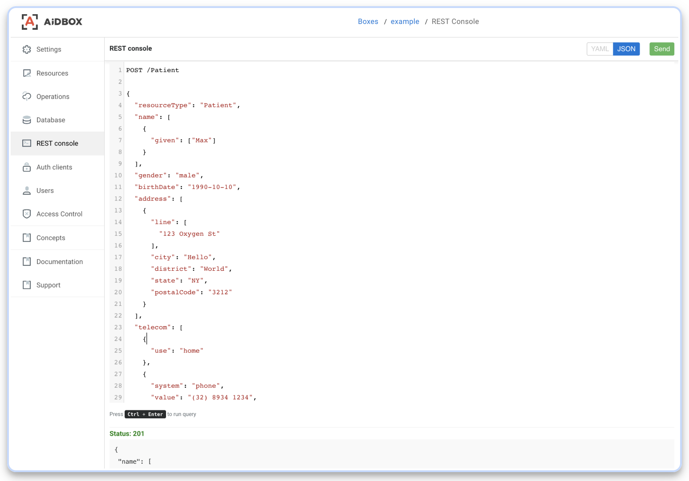

# Play with REST console and Patient resource

### REST console

Last time, we stopped at using our REST console. Let's see how to use it.


REST console is designed to work with resources on your `Box` by sending HTTP requests. To do this, we need to type - a HTTP verb \(`GET`, `POST`, `PUT`, `DELETE`\) and the address of the resource \(for example `/Patient` - pay attention to the resource name with a capital letter\), in cases when you need to send the request body \(for example, a `POST` request\), it passed in indented one line below, in YAML or JSON format.

Last time we learned how to get a list of our patients \(by requesting them through the `GET / Patient`\) and it was empty. Let's add a couple of new patients -  for this we type in our console `POST /Patient` and in the body of the request we will send the data of our new patient:



```javascript
POST /Patient

{
  "resourceType": "Patient",
  "name": [
    {
      "given": ["Max"]
    }
  ],
  "gender": "male",
  "birthDate": "1990-10-10",
  "address": [
    {
      "line": [
        "123 Oxygen St"
      ],
      "city": "Hello",
      "district": "World",
      "state": "NY",
      "postalCode": "3212"
    }
  ],
  "telecom": [
    {
      "use": "home"
    },
    {
      "system": "phone",
      "value": "(32) 8934 1234",
      "use": "work",
      "rank": 1
    }
  ]
}
```



```javascript
Status: 201

{
 "name": [
  {
   "given": [
    "Max"
   ]
  }
 ],
 "gender": "male",
 // another sended Patient data//
 "id": "14dc3340-2ac1-4595-bbb7-3803b08c8f6f",
 "resourceType": "Patient",
 "meta": {
  "lastUpdated": "2018-10-18T16:32:53.038Z",
  "versionId": "5",
  "tag": [
   {
    "system": "https://aidbox.io",
    "code": "created"
   }
  ]
 }
}
```



Also see [Patient resource example](https://www.hl7.org/fhir/patient-example.json.html)

After sending the request - we receive a response with `Status - 201` and the sent data - our patient is created. We can also make sure of this by requesting a complete list of patients - `GET /Patients` - and we will see the data of our created user.



Обновление

Удаление

  


  


