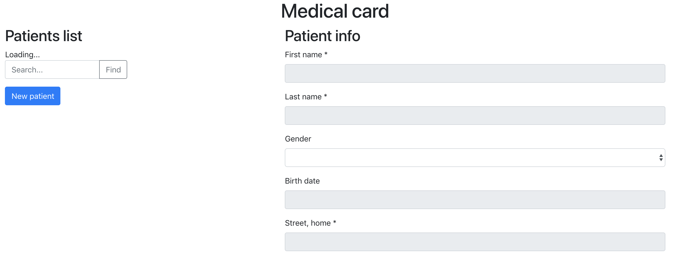

# Run local demo \(draft\)

### Introduction

In this guide we locally launch FHIR-application based on Aidbox and experiment with the [`Patient resource`](https://www.hl7.org/fhir/patient.html).

### Installation and run

Our application consists of two parts - backend and frontend.

On backend part we will use [Aidbox for developers](../devbox/), and for frontend we have demo application made with Angular and Typescript. 


[Devbox installation guide](../installation/)


 After successful install and launch let's go to directory with our demo:

```text
cd devbox/samples/angular-frontend/
```


We will need an installed node version above 8


Install dependencies:

```text
npm ci
```

And launch frontend:

```text
ng server
```

After start - open your browser and go to `localhost:4200` - we will see our simple app.



It is a list of patients and information about them. Patient - it's a [FHIR resource](https://www.hl7.org/fhir/resourcelist.html).  We can create, view, edit, and delete patient data — standard set of CRUD operations. Also in this demo, we have the ability to search by last/first name and paginated output of patients list.

### Our task

Now let's try to create new Patient.

Press `New patient` and fill fields with information about resource. Note - fields marked with `*` - are required. Fill out our first patient card, you can add multiple phones and emails. After you're done press `Submit` and voila! We create our first resource - patient, it shows at list at left.

Try creating some more patients yourself, also don't forget try to update and delete them ;\)

This is not full list opportunities of our backend service. Devbox allows you to use itself as a ready backend for your application. Based on it, you can create web, mobile applications, services and much more \(see our folder with examples\).

### What's inside? \(Advanced part\)

Let's see what happened to our patients

Connect to our database

```text
psql lala
\c
```

And we will request a list of our patients:

```text
select * from patients;
```

And receive something like this:

```text


```

