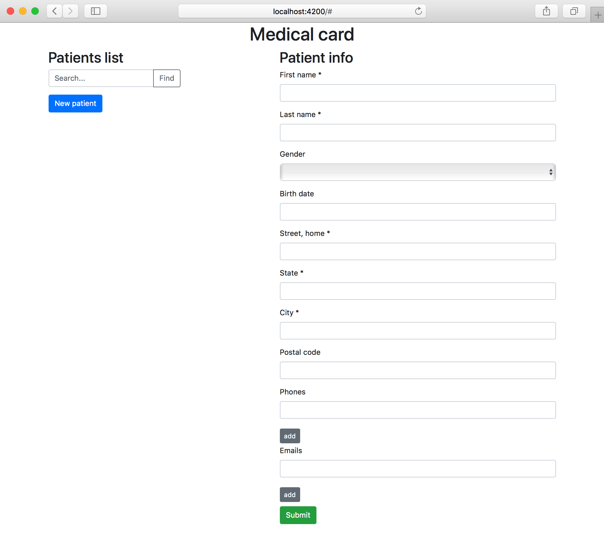

# Patient CRUD SPA

## Introduction

In this guide we will  locally launch FHIR application based on Aidbox.Dev.

### Install backend

Visit to [Aidbox
documentation](https://docs.aidbox.app/installation/setup-aidbox.dev) for
detailed information and instruction how to install Aidbox for development


[Devbox installation guide](../installation/)


### Clone repository

``` bash
 $ git clone https://github.com/HealthSamurai/aidbox-angular-sample.git
 $ cd aidbox-angular-sample

```

###  Configure Base URL

__Aidbox.Dev__

If you use Aidbox.Dev as a backend, you need specify `AIDBOX_URL` http://localhost:8888

``` typescript
export const environment = {
  AIDBOX_URL : "http://localhost:8888"
}
```

__Aidbox.Coud__

When you want run this sample application with Aidbox.Cloud you need
specify `AIDBOX_URL` as https://<YOUR_BOX_NAME>.aidbox.app.

``` typescript
export const environment = {
  AIDBOX_URL : "https://<YOUR_BOX_NAME>.aidbox.app"
}
```

### Requirements

This sample application required minimal [Node JS version 8.9](https://nodejs.org/en/)


### Installation and start

``` bash
 $ npm install
 $ npm install -g @angular/cli 
 $ ng serve

```


 After successful install and launch let's go to directory with our demo:


We will need an installed node version above 8


Install dependencies:

```bash
$ npm install
$ npm install -g @angular/cli
```

Now you need configure your FHIR server base url. This setting located in `environment.ts` file. If you run Aidbox.Dev on default port `8888`, you can skep this step.



```typescript
export const environment = {
  AIDBOX_URL : "http://localhost:8888"
}

```



And launch frontend:

```bash
$ ng server
```

After start - open your browser and go to [`http://localhost:4200`](http://localhost:4200) - we will see our simple app.



It is a list of patients and information about them. Patient - it's a [FHIR resource](https://www.hl7.org/fhir/resourcelist.html).  We can create, view, edit, and delete patient data — standard set of CRUD operations. Also in this demo, we have the ability to search by last/first name and paginated output of patients list.

