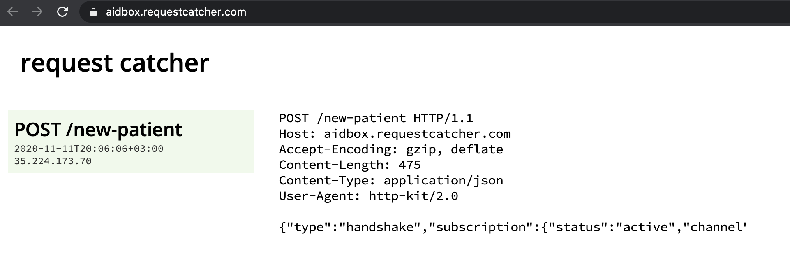
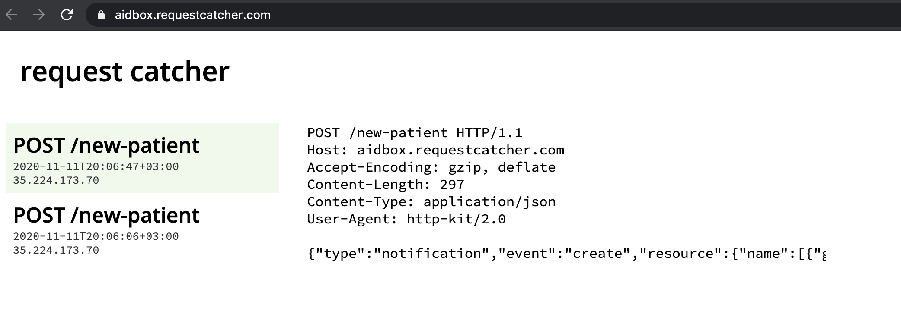

# Subscribe to new Patient resource

Aidbox [subscriptions module](../advanced/reactive-api-and-subscriptions/subscriptions-1.md) is a way to subscribe and get notifications about updating resources on server. It introduces two new resourceTypes into Aidbox:

* SubsSubscription — meta-resource, which binds events \(create/update/delete resource\) with communication channel through which subscriber will be notified about.
* SubsNotification — resource, which represents notification with its status \(sent or not\).

In order to start receive notifications, you have to register your services as a subscriber in Aidbox by creating **SubsSubscription** resource.

As external service to integrate Aidbox with we will you [RequestCatcher](https://requestcatcher.com/). We will use aidbox name, so the final name of our service will be [https://aidbox.requestcatcher.com/](https://aidbox.requestcatcher.com/). You can use your own name, doesn't matter.

Open [https://aidbox.requestcatcher.com/](https://aidbox.requestcatcher.com/) in new tab, then create next **SubsSubsription** resource in your Aidbox instance:

```yaml
POST /SubsSubscription

id: new-patient-sub
status: active
trigger:
  Patient: 
    event: ['create']
channel:
  type: rest-hook
  endpoint: https://aidbox.requestcatcher.com/new-patient
  timeout:  1000
  payload:
    content: full-resource
    contentType: json
```

After you did it aidbox sends on channel.endpoint handshake notification, which you can see on your opened tab with RequestCatcher.



Let's create new patient then.

```yaml
POST /Patient

id: john-smith 
name:
- given: [John]
  family: Smith

# Response: 201 Created
```

Then you can back to RequestCatcher service and see new notification.



And next, you can see **SubsNotification** resource created for this notification in Aidbox.

```yaml
GET /SubsNotification?_sort=-lastUpdated

# Response

type: searchset
resourceType: Bundle
entry:
- resource:
    id: 17efebc5-c4e2-4db8-b999-dd5c24b7dfc5
    resourceType: SubsNotification
    status: success
    duration: 99
    response: {body: request caught, status: 200}
    notification:
      type: notification
      event: create
      resource:
        id: john-smith
        name:
        - given: [John]
          family: Smith
        resourceType: Patient
    subscription: {id: new-patient-sub, resourceType: SubsSubscription}
# ... other notification
```

If you will update your patient, then notification will not be created, because we subscribed only for creation of Patient resource.

```yaml
PUT /Patient/john-smith

name:
- given: [John]
  family: Smith
gender: male

# Response: 200 OK
```

Check RequestCatcher and SubsNotification. You will not find new notification there.

