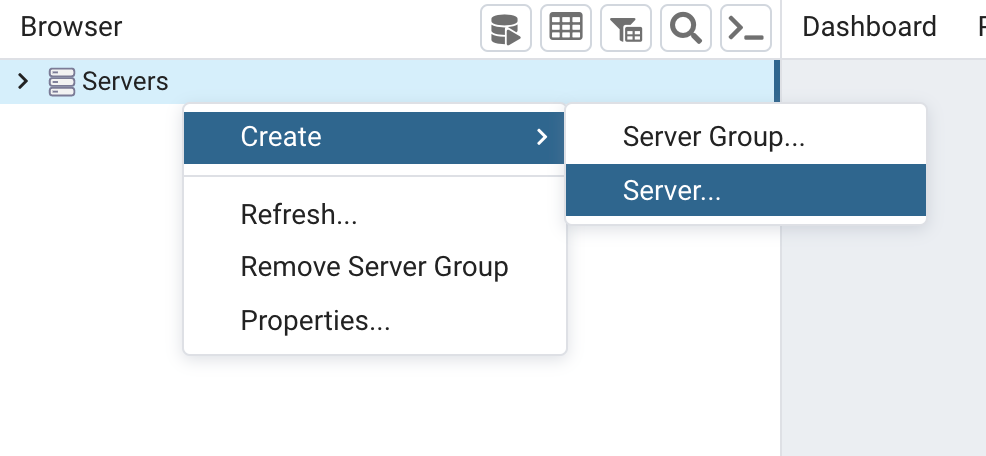
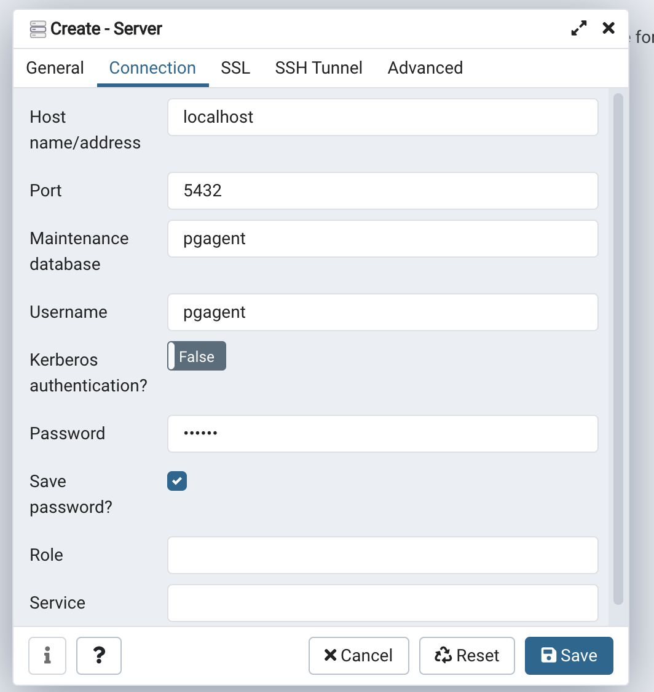
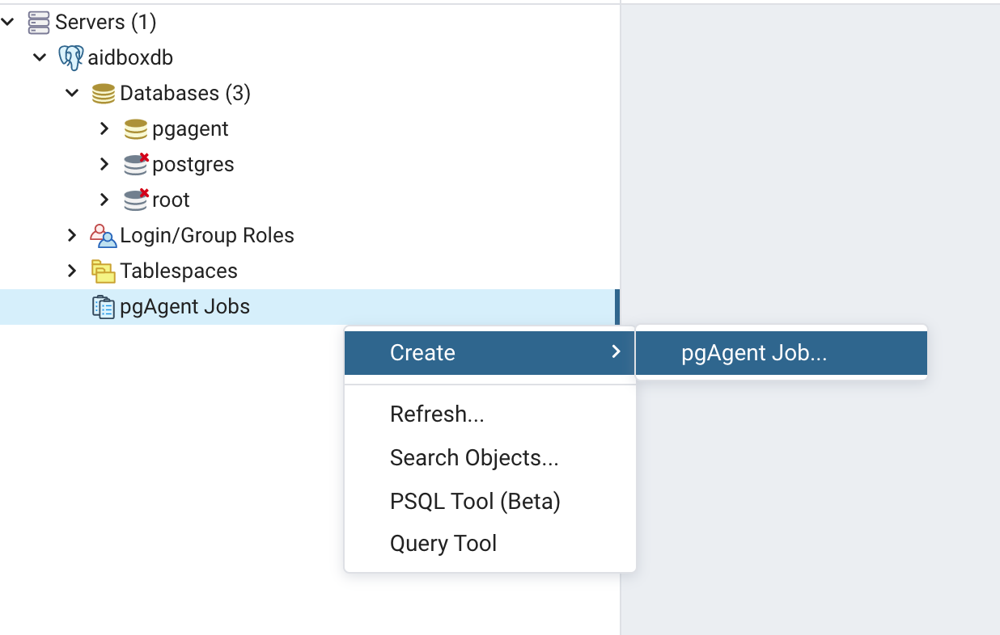
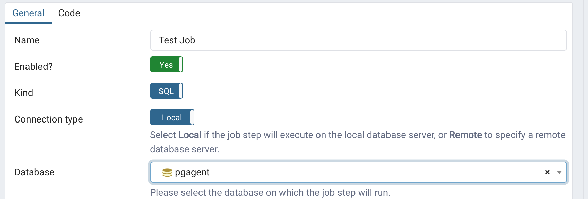
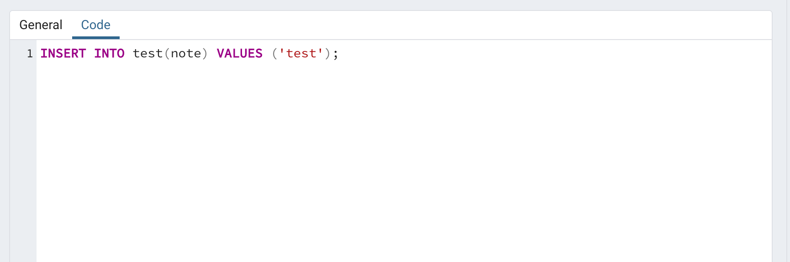
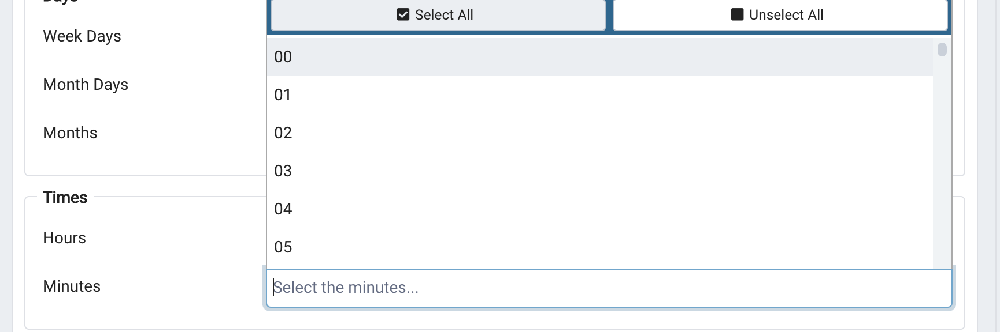

# Working with pgAgent

## Introduction


Currently available only in `aidboxdb:13.2 or later.`


PgAgent provides an ability to run user-defined jobs on the Postgres database. It runs as a separate process on a system with Postgres databases.

Aidboxdb comes with PgAgent preinstalled.

By default, aidboxdb container doesn't start the PgAgent daemon. To start the daemon you need to specify `PGAGENT_ENABLED` variable. If the variable is specified then the daemon will be started on container startup.


PgAgent wouldn't run if Postgres instance is run as a replica (`PG_ROLE` is not equal to `'replica'`) because it may lead to unexpected behavior.



PgAgent will run on **every** instance of Postgres master, which may lead to unexpected behavior.


By default PgAgent process in aidboxdb will use a database specified in `POSTGRES_DB` environmental variable and will run as a user which is specified in `POSTGRES_USER` variable (`postgres` by default).

If you want to specify **a dedicated user** for PgAgent (for example to limit PgAgent privileges), you need to specify `PGAGENT_USER` and `PGAGENT_PASSWORD` variables.

If you want to use **a dedicated database** to store PgAgent service data, you can specify it in `PGAGENT_DB` variable. But you have to create the database and extension manually before starting PgAgent.


**Note:** if you want to use a dedicated user or database you need to create them manually before enabling PgAgent in your aidboxdb configuration.

Don't forget to create the PgAgent extension if your choose to use a dedicated database.\
To create the extension run `CREATE EXTENSION pgagent;`


There are some more options available to configure PgAgent:\
You can specify log level with `PGAGENT_LOG_LEVEL` and you can specify a file where PgAagent logs are written in `PGAGENT_LOG_FILE_PATH`.

You can see more info on [configuring aidboxdb](../overview/aidboxdb-image.md).

## Step-by-step example with docker

In this example we will setup simple `pgagent` job with dedicated pgagent database and user.

### Configuring PgAgent

First, we will need to create an initial `docker-compose` configuration:


```yaml
services:
  db:
    container_name: aidboxdb
    image: healthsamurai/aidboxdb:13.2
    ports:
      - '5432:5432'
    environment:
      POSTGRES_USER: postgres
      POSTGRES_PASSWORD: postgres
      POSTGRES_DB: postgres
```


Start container:

```bash
docker-compose up -d
```

Now let's create a database, extension, test table, and user.

Connect to postgres with:

```bash
docker exec -it aidboxdb ps
```

And run following commands:

```sql
CREATE DATABASE pgagent;
\c pgagent

CREATE EXTENSION pgagent;

CREATE TABLE test(tx timestamptz default now(), note text);

CREATE USER "pgagent" WITH
  LOGIN
  NOSUPERUSER
  INHERIT
  NOCREATEDB
  NOCREATEROLE
  NOREPLICATION
  encrypted password 'secret';

GRANT USAGE ON SCHEMA pgagent TO pgagent;
GRANT ALL PRIVILEGES ON ALL TABLES IN SCHEMA pgagent TO pgagent;
GRANT ALL PRIVILEGES ON ALL SEQUENCES IN SCHEMA pgagent TO pgagent;
GRANT ALL PRIVILEGES ON ALL TABLES IN SCHEMA public TO pgagent;
GRANT ALL PRIVILEGES ON ALL SEQUENCES IN SCHEMA public TO pgagent;
```

After you've run commands update`docker-compose.yaml` file:


```yaml
services:
  db:
    container_name: aidboxdb
    image: 'healthsamurai/aidboxdb:13.2'
    ports:
      - '5432:5432'
    environment:
      POSTGRES_USER: postgres
      POSTGRES_PASSWORD: postgres
      POSTGRES_DB: postgres
      PGAGENT_ENABLED: 'true' # Must be string
      PGAGENT_USER: pgagent
      PGAGENT_PASSWORD: secret
      PGAGENT_DB: pgagent
      PGAGENT_LOG_LEVEL: 2
```


And re-create container:

```bash
docker-compose up -d
```

Let's exec into the container and see what is going on.

```bash
docker exec -it aidboxdb bash
```

First let's run `pgrep command`:



```bash
pgrep pgagent
```



```
9
```



You can use `ps aux` command if you want to see more details on `pgagent` arguments:



```bash
ps aux | grep pgagent
```



```
pgagent -s /tmp/pgagent.log -l 1 host=localhost port=5432 dbname=pgagent user=pgagent password=secret
```



Let's check `pgagent` logs:



```
cat /tmp/pgagent.logs
```



```
WARNING: Couldn't create the primary connection [Attempt #2]
DEBUG: Clearing all connections
DEBUG: Connection stats: total - 1, free - 0, deleted - 1
DEBUG: Creating primary connection
DEBUG: Parsing connection information...
DEBUG: user: pgagent
DEBUG: password: *****
DEBUG: dbname: pgagent
DEBUG: host: localhost
DEBUG: port: 5432
DEBUG: Creating DB connection: user=pgagent password=secret  host=localhost port=5432 dbname=pgagent
DEBUG: Database sanity check
DEBUG: Clearing zombies
DEBUG: Checking for jobs to run
DEBUG: Sleeping...
DEBUG: Clearing inactive connections
DEBUG: Connection stats: total - 1, free - 0, deleted - 0
DEBUG: Checking for jobs to run
DEBUG: Sleeping...
```




Don't worry if you see `WARNING: Couldn't create the primary connection [Attempt #2]` – postgres takes some time to start and pgagent will reconnect as soon as postgres is ready to accept connections.


### Defining a job via PgAdmin


Refer to [https://www.pgadmin.org/](https://www.pgadmin.org/) for pgAdmin and pgAgent documentation.


Now when pgagent is up and running we can define some jobs and see if they're actually scheduled.













#### Test if jobs are running

Let's connect into postgres to see if jobs are actually running.

```bash
docker exec -it aidboxdb psql pgagent
```

We can check scheduled jobs, last and next time their run in `pgagent.pga_job` table.



```sql
--turn on extended view
\x
SELECT * FROM pgagent.pga_job;
```



```
-[ RECORD 1 ]+------------------------------
jobid        | 1
jobjclid     | 1
jobname      | Test Job
jobdesc      |
jobhostagent |
jobenabled   | t
jobcreated   | 2021-08-06 02:05:39.111269+00
jobchanged   | 2021-08-06 02:05:39.111269+00
jobagentid   |
jobnextrun   | 2021-08-06 02:06:00+00
joblastrun   |
```



Let's test if job was run in our `test` table:



```sql
SELECT * FROM test;
```



```
-[ RECORD 1 ]-----------------------
tx   | 2021-08-06 02:06:03.970728+00
note | test
```



If everything was successfull you will see new records in the table.

## Summary

* `pgagent` is a tool to run various jobs on your postgres database.
* `pgagent` runs only if `PGAGENT_ENABLED` variable is present.
* You can configure `pgagent` using several variables described [here](../overview/aidboxdb-image.md#optional-environment-variables).

If you have any questions on how to configure `pgagent` feel free to [contact us](../contact-us.md).
